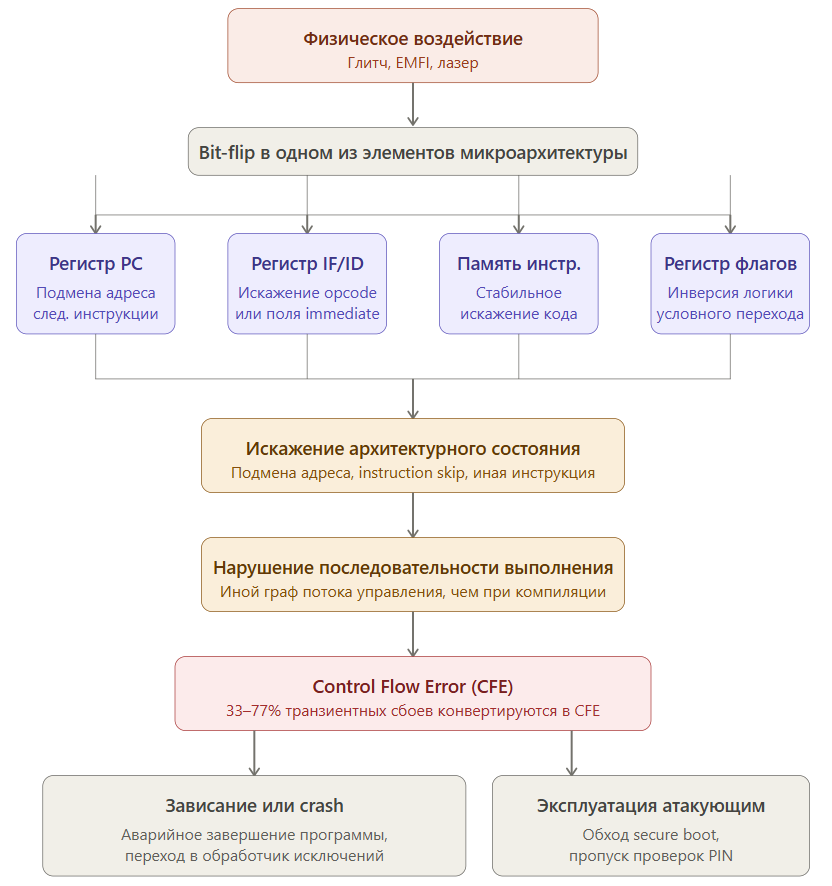
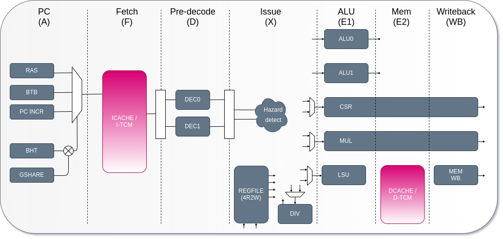
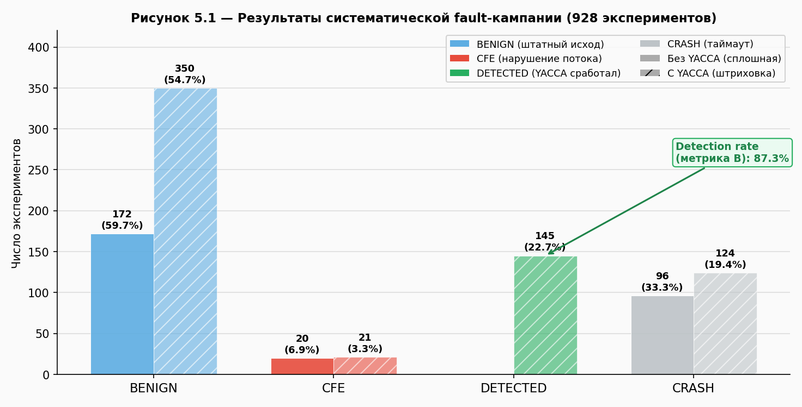
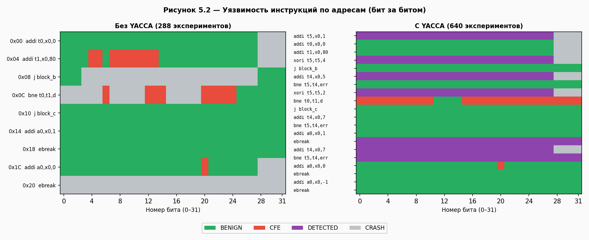
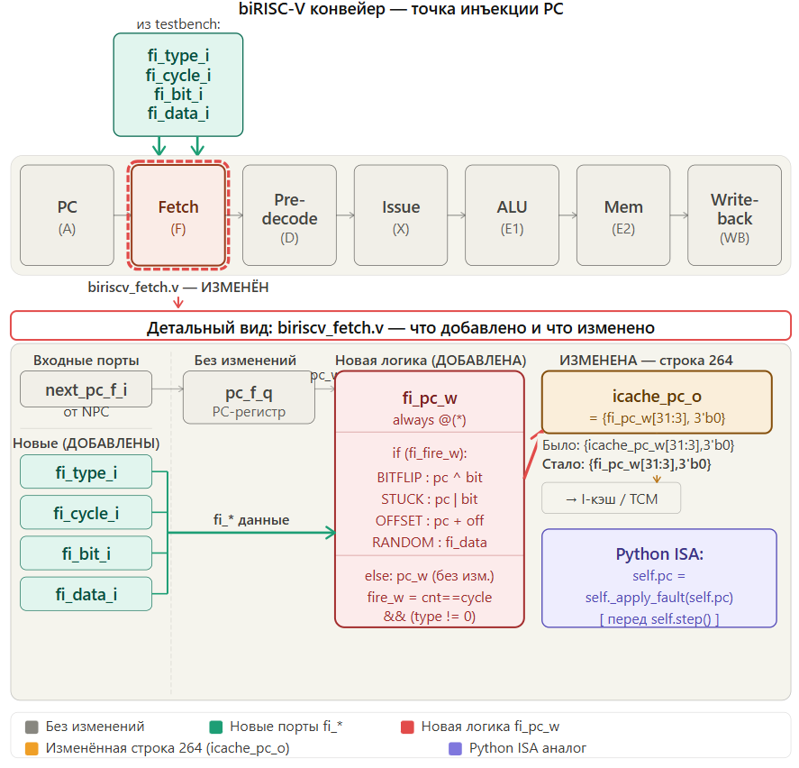
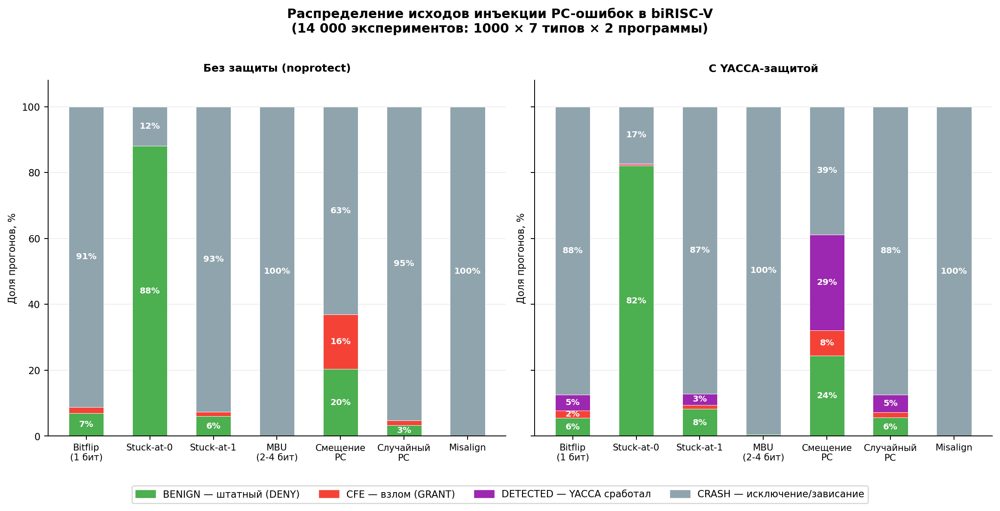
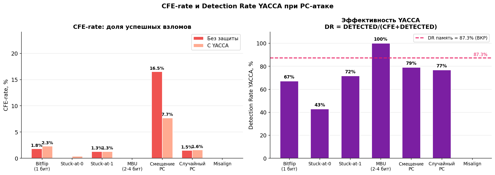
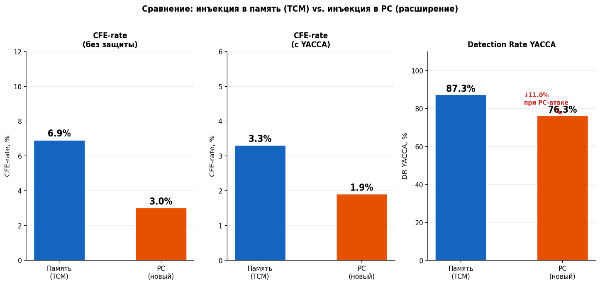
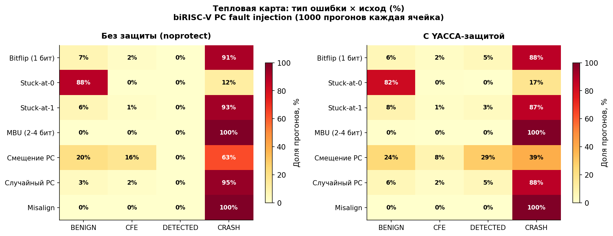

# Разработка системы моделирования fault-атак на процессорное ядро biRISC-V для анализа устойчивости к инъекции ошибок

**Выпускная квалификационная работа — магистерская диссертация**

по направлению 10.04.01 «Информационная безопасность»

образовательной программы магистратуры «Кибербезопасность»

---

**Федеральное государственное автономное образовательное учреждение высшего образования «Национальный исследовательский университет «Высшая школа экономики»**

**Московский институт электроники и математики им. А.Н. Тихонова**

| | |
| --- | --- |
| **Студент:** Рыбалка Иван Петрович (группа МКБ-241) | **Научный руководитель:** Мещеряков Ярослав Евгеньевич, к.т.н., доцент кафедры информационной безопасности киберфизических систем МИЭМ НИУ ВШЭ |

Москва, 2026

---

## Аннотация

Целью работы является разработка системы моделирования fault-атак (атак с инъекцией ошибок) на процессорное ядро biRISC-V и количественная оценка эффективности методологии YACCA как защитного механизма. Актуальность обусловлена растущим распространением архитектуры RISC-V благодаря инвестициям крупных компаний и её активному использованию в научной среде. Открытый исходный код, простота реализации и наследование лучших практик RISC-архитектур делают RISC-V перспективной, но и потенциально уязвимой платформой. Количество уязвимостей в современных процессорах продолжает расти, особенно в открытых архитектурах, что требует создания инструментов для анализа и повышения их устойчивости к аппаратным атакам.

Научная новизна заключается в создании специализированного симулятора, позволяющего детально изучать воздействие fault-атак на микроархитектурном уровне, что ранее не было полноценно реализовано для открытых RISC-V решений.

Практическая значимость состоит в возможности использования симулятора для:
1. образовательных целей (демонстрация механизмов атак и защиты);
2. исследовательской работы (анализ уязвимостей и тестирование контрмер);
3. разработки защищённых процессорных ядер на этапе проектирования.

Структура работы включает 84 страницы, содержит 12 рисунков, 17 таблиц, 58 источников, а также 1 приложение.

## Abstract

The aim of this work is to develop a software simulator for modeling fault attacks (error injection attacks) on the biRISC-V processor core in order to assess its resilience to hardware impacts. The relevance of the work is driven by the growing adoption of the RISC-V architecture due to investments from major companies and its active use in the scientific community. The open-source nature, simplicity of implementation, and inheritance of best practices from RISC architectures make RISC-V a promising yet potentially vulnerable platform. The number of vulnerabilities in modern processors continues to increase, particularly in open architectures, necessitating the development of tools for analyzing and enhancing their resilience to hardware attacks.

The scientific novelty lies in the creation of a specialized simulator that enables detailed study of the effects of fault attacks at the microarchitectural level, which has not been fully implemented previously for open RISC-V solutions.

The practical significance of the simulator includes its use for:
1. educational purposes (demonstrating attack and defense mechanisms);
2. research work (vulnerability analysis and testing of countermeasures);
3. development of secure processor cores at the design stage.

The structure of the work comprises 84 pages, includes 12 figures, 17 tables, 58 references, and 1 appendix.

---

## Содержание

- [1. Введение](#1-введение)
  - [1.1. Актуальность и проблемная область](#11-актуальность-и-проблемная-область)
  - [1.2. Уязвимость архитектуры RISC-V: открытость как новая поверхность атаки](#12-уязвимость-архитектуры-risc-v-открытость-как-новая-поверхность-атаки)
  - [1.3. Эволюция fault-атак: от теории к практике на RISC-V](#13-эволюция-fault-атак-от-теории-к-практике-на-risc-v)
  - [1.4. Конкретные уязвимости 2026 года: микроархитектурные ловушки](#14-конкретные-уязвимости-2026-года-микроархитектурные-ловушки)
  - [1.5. Ошибки потока управления как критическое последствие fault-атак](#15-ошибки-потока-управления-как-критическое-последствие-fault-атак)
  - [1.6. Проблема моделирования и анализа](#16-проблема-моделирования-и-анализа)
  - [1.7. Программные контрмеры и проблема их выбора](#17-программные-контрмеры-и-проблема-их-выбора)
  - [1.8. Итоговая формулировка проблемы и цель работы](#18-итоговая-формулировка-проблемы-и-цель-работы)
- [2. Анализ проблемы и существующих решений](#2-анализ-проблемы-и-существующих-решений)
  - [2.1. Кибербезопасность встроенных систем и аппаратные уязвимости](#21-кибербезопасность-встроенных-систем-и-аппаратные-уязвимости)
  - [2.2. Классификация fault-атак и физических воздействий](#22-классификация-fault-атак-и-физических-воздействий)
  - [2.3. Архитектура RISC-V и процессорного ядра biRISC-V](#23-архитектура-risc-v-и-процессорного-ядра-birisc-v)
  - [2.4. Обзор существующих методов моделирования fault-атак](#24-обзор-существующих-методов-моделирования-fault-атак)
  - [2.5. Системы защиты от fault-атак: подходы и ограничения](#25-системы-защиты-от-fault-атак-подходы-и-ограничения)
  - [2.6. Выводы по обзору и исследования](#26-выводы-по-обзору-и-исследования)
- [3. Архитектура системы моделирования fault-атак](#3-архитектура-системы-моделирования-fault-атак)
  - [3.1. Общая архитектура системы](#31-общая-архитектура-системы)
  - [3.2. Модель инъекции ошибок и её параметризация](#32-модель-инъекции-ошибок-и-её-параметризация)
  - [3.3. Интеграция с RTL-моделью biRISC-V](#33-интеграция-с-rtl-моделью-birisc-v)
  - [3.4. Система управления экспериментом](#34-система-управления-экспериментом)
  - [3.5. Механизмы сбора и анализа данных](#35-механизмы-сбора-и-анализа-данных)
  - [3.6. Производительность и масштабируемость решения](#36-производительность-и-масштабируемость-решения)
- [4. Реализация системы моделирования](#4-реализация-системы-моделирования)
  - [4.1. Моделирование инъекции через прямой доступ к памяти TCM](#41-моделирование-инъекции-через-прямой-доступ-к-памяти-tcm)
  - [4.2. Реализация механизмов инъекции ошибок](#42-реализация-механизмов-инъекции-ошибок)
  - [4.3. Система автоматизированного тестирования](#43-система-автоматизированного-тестирования)
  - [4.4. Интеграция с симуляторами Verilog](#44-интеграция-с-симуляторами-verilog)
  - [4.5. Реализация защитных механизмов YACCA](#45-реализация-защитных-механизмов-yacca)
  - [4.6. Накладные расходы YACCA](#46-накладные-расходы-yacca)
  - [4.7. Систематическое fault-исследование](#47-систематическое-fault-исследование)
  - [4.8. Моделирование инъекции через указатель инструкций (PC)](#48-моделирование-инъекции-через-указатель-инструкций-pc)
- [5. Заключение](#5-заключение)
  - [5.1. Выводы результатов по инъекции в память (TCM)](#51-выводы-результатов-по-инъекции-в-память-tcm)
  - [5.2. Выводы результатов по инъекции в указатель инструкций (PC)](#52-выводы-результатов-по-инъекции-в-указатель-инструкций-pc)
  - [5.3. Научная значимость](#53-научная-значимость)
  - [5.4. Практическая значимость](#54-практическая-значимость)
  - [5.5. Перспективы развития](#55-перспективы-развития)
- [6. Список использованных источников](#6-список-использованных-источников)
- [Приложение А](#приложение-а)

---

## 1. Введение

Настоящая работа посвящена разработке системы моделирования fault-атак (атак с инъекцией ошибок) на процессорное ядро RISC-V для анализа его устойчивости, а также выбору и реализации программных контрмер, предназначенных для обнаружения возникающих нарушений. В качестве основы для реализации защитных механизмов рассматривается методология YACCA (Yet Another Control-flow Checking using Assertions), ориентированная на обнаружение ошибок потока управления.

### 1.1. Актуальность и проблемная область

Современные встроенные системы лежат в основе критической инфраструктуры: от автомобильной электроники и до промышленных контроллеров и устройств Интернета вещей (IoT). Безопасность этих систем традиционно строится на предположении, что аппаратное обеспечение является «корнем доверия» (root of trust). Однако, как показывают последние исследования, это предположение всё чаще оказывается уязвимым местом. Аппаратные атаки, в частности fault-атаки (инъекции ошибок), позволяют злоумышленнику обходить программные механизмы защиты, воздействуя непосредственно на физическую среду выполнения кода.

### 1.2. Уязвимость архитектуры RISC-V: открытость как новая поверхность атаки

Архитектура RISC-V набирает популярность благодаря своей открытости, гибкости и инвестициям со стороны крупнейших игроков индустрии. Однако эта же открытость создает новые риски. В отличие от закрытых архитектур (x86, ARM), где многолетний опыт производства привел к формированию определенных уже по умолчанию систем безопасности, экосистема RISC-V находится в стадии становления.

На конференции FOSDEM 2026 [\[1\]](#ref-1) был поднят вопрос о практике производителей коммерческих RISC-V CPU. Доклад показал три типичные проблемы: небезопасные настройки по умолчанию, выбираемые ради производительности; расширения ISA, которые отгружаются без полноценной верификации; отсутствие механизмов защиты от спекулятивных атак. Из-за этого даже in-order-ядра содержат изъяны архитектуры и каналы побочной утечки данных. Случай GhostWrite в T-Head XuanTie C910 — наглядный тому пример: реализация разошлась со спецификацией настолько, что неавторизованный код получил прямую запись в физическую память [\[2\]](#ref-2).

### 1.3. Эволюция fault-атак: от теории к практике на RISC-V

Fault-атака — это физическое воздействие на процессор с целью спровоцировать сбой в его работе (так называемый глитч-эффект). Чаще всего применяются три вектора:

- **Глитчи тактовой частоты (Clock Glitching):** Кратковременное изменение частоты тактового генератора для пропуска инструкций или искажения данных.
- **Глитчи питания (Voltage Glitching):** Броски напряжения, вызывающие нестабильность работы логических элементов.
- **Электромагнитное воздействие (EMFI):** Локальное наведение вихревых токов для переключения битов.

Современные работы показывают, что RISC-V уязвим к таким атакам — включая системы с Trusted Execution Environments (TEE). На практике это означает не просто отказ системы: атакующий может повысить привилегии, считать криптографический ключ или подменить данные в памяти, минуя любые программные проверки.

Стоит отметить, что инструментарий тоже не отстаёт. Open-source-проекты вроде lowRISC и платформы NewAE (ChipWhisperer, ChipShouter) делают fault-инъекции и анализ побочных каналов доступными даже за пределами специализированных лабораторий [\[3\]](#ref-3), [\[4\]](#ref-4).

### 1.4. Конкретные уязвимости 2026 года: микроархитектурные ловушки

Проблема усугубляется тем, что современные RISC-V ядра становятся сложнее, начиная наследовать проблемы x86 и ARM архитектур, связанные со спекулятивным выполнением (speculative execution) и оптимизацией производительности.

- **Расширение спектра уязвимостей:** в начале 2026 года в Linux ядро были внесены исправления для RISC-V, закрывающие векторы микроархитектурных атак, связанные со спекулятивным доступом к таблице системных вызовов (аналог Spectre-подобных атак). Это подтверждает, что RISC-V не обладает «врожденным» иммунитетом к классам уязвимостей, десятилетиями преследующим x86. Согласно отчёту Phoronix от января 2026 г., серия патчей, нацеленная на ядро Linux 6.19, добавляет защиту от спекулятивного доступа к таблице системных вызовов в подсистеме RISC-V [\[5\]](#ref-5).

- **Критические ошибки реализации (GhostWrite):** Фаззинг-фреймворк RISCover нашёл в коммерческом ядре T-Head XuanTie C910 уязвимость, при которой непривилегированный код пишет напрямую в физическую память. Все механизмы виртуализации при этом обходятся. Такие ошибки, как GhostWrite, делают традиционные fault-атаки еще более опасными, так как снижают порог сложности для злоумышленника [\[6\]](#ref-6).

- **Уязвимости класса Halt-and-Catch-Fire в коммерческих RISC-V CPU:** тот же фреймворк дифференциального фаззинга (differential fuzzing), что обнаружил GhostWrite, выявил отдельный класс уязвимостей в ядрах T-Head XuanTie C906 и C908 — специальные последовательности инструкций приводят к полному зависанию ядра, требующему аппаратного сброса [\[7\]](#ref-7), [\[8\]](#ref-8). Эти инциденты [\[9\]](#ref-9) подчёркивают, что коммерческие RISC-V реализации содержат не только эксплуатируемые ошибки записи (как GhostWrite), но и уязвимости класса «отказ в обслуживании», обнаруживаемые только систематической верификацией на ранних стадиях.

- **Микроархитектурный шпионаж:** Исследователи из Telecom Paris показали, что даже механизмы предсказания переходов в RISC-V ядрах с внеочередным исполнением (out-of-order) могут быть использованы для извлечения секретной информации с высокой точностью, что открывает новые векторы атак на базе анализа времени выполнения [\[10\]](#ref-10).

### 1.5. Ошибки потока управления как критическое последствие fault-атак

Особое место среди последствий fault-атак занимают ошибки потока управления (Control Flow Errors, CFE). По сути, это срыв штатной последовательности выполнения программы, вызванный физическим воздействием на железо. Эксперименты показывают, что от 33% до 77% транзиентных сбоев превращаются именно в CFE; всё остальное относится к ошибкам потока данных [\[12\]](#ref-12). На практике это означает, что защита потока управления — приоритет №1 при проектировании надёжных embedded-систем.

Физический механизм CFE достаточно подробно описан в работе [\[14\]](#ref-14). Внешние воздействия — EMI, глитчи питания, глитчи тактовой частоты, ионизирующее излучение — приводят к инверсии отдельных битов в чувствительных элементах CPU: программном счётчике (PC), регистровом файле, дешифраторе инструкций, памяти.

В зависимости от того, какой именно бит инвертирован, последствия могут варьироваться от безобидного искажения операнда до полного срыва выполнения программы. Так, инверсия бита в регистре PC приводит к мгновенному переходу на произвольный адрес; искажение поля кода операции в инструкции `bne` может превратить её в `beq`, инвертировав логику ветвления [\[4\]](#ref-4); повреждение управляющего регистра вызывает зависание системы или генерацию исключения [\[13\]](#ref-13).

Для систем критического применения — автомобильной электроники, авионики, промышленных контроллеров и медицинских устройств — последствия CFE могут быть катастрофическими: программа может «зависнуть» в бесконечном цикле, выполнить непредусмотренные ветви кода или предоставить злоумышленнику возможность обхода проверок безопасности [\[15\]](#ref-15). Помимо CFE, fault-атаки могут проявляться и как ошибки потока данных (data flow errors), повреждая значения переменных в памяти или регистрах. Однако этот класс ошибок имеет принципиально иную природу и требует отдельных методов обнаружения (например, дублирования вычислений или кодов с обнаружением ошибок); поэтому в рамках настоящей работы он не рассматривается.

### 1.6. Проблема моделирования и анализа

Ключевая проблема индустрии состоит в том, что существующие подходы к моделированию fault-атак располагаются на двух полюсах. С одной стороны, находятся ISA-симуляторы (QEMU, Spike), оперирующие на уровне абстрактных битовых инверсий в архитектурном состоянии и не учитывающие микроархитектурных особенностей конкретного ядра. С другой — физические тестовые стенды (лазерные установки, EMFI-зонды, генераторы глитчей), позволяющие точно воспроизводить реальные воздействия, но требующие наличия готового кристалла, дорогостоящего оборудования и специализированных лабораторий. Этот разрыв между точной, но пост-силиконовой физикой и быстрой, но абстрактной программной симуляцией признан в литературе одной из ключевых проблем оценки устойчивости встраиваемых процессоров [\[11\]](#ref-11), [\[17\]](#ref-17).

Для архитектуры RISC-V проблема стоит особенно остро. Открытость спецификации привлекла большое количество разработчиков, многие из которых не имеют доступа к коммерческим инструментам пре-силиконовой валидации устойчивости к инъекции ошибок. Как следствие, оценка уязвимости проектируемых ядер к физическим атакам систематически откладывается до пост-силиконовой стадии или вовсе не выполняется, что приводит к выпуску уязвимых устройств в коммерческую эксплуатацию. Современные академические работы по pre-silicon анализу для RISC-V [\[16\]](#ref-16), [\[17\]](#ref-17) показывают принципиальную возможность закрытия этого разрыва на уровне RTL-моделирования.

В качестве защитного механизма в данной работе рассматривается методология YACCA (Yet Another Control-flow Checking using Assertions) [\[14\]](#ref-14), [\[18\]](#ref-18) — техника программного контроля потока управления, основанная на присвоении базовым блокам уникальных сигнатур и проверке корректности переходов между ними средствами вставленных в код утверждений (assertions). Однако для адаптации YACCA к конкретному процессорному ядру и количественной оценки её эффективности необходима симуляционная среда, способная воспроизводить целевые fault-атаки и верифицировать реакцию защитных механизмов на ранних этапах проектирования.

В то же время развитие стандартов надёжности для RISC-V продолжается: в списке рассылки ядра Linux недавно представлена серия патчей для добавления поддержки RAS (Reliability, Availability and Serviceability), что позволит эффективнее обрабатывать аппаратные ошибки в будущем [\[11\]](#ref-11).

### 1.7. Программные контрмеры и проблема их выбора

Среди разработанных за последние десятилетия подходов к защите от ошибок потока управления выделяется класс методов SIHFT (Software-Implemented Hardware Fault Tolerance) — программных контрмер, реализуемых без модификации аппаратуры [\[18\]](#ref-18). Базовый принцип таких методов состоит во внедрении в исходный или ассемблерный код целевой программы специальных конструкций — сигнатур базовых блоков и проверочных утверждений (assertions), — которые на этапе выполнения позволяют обнаружить отклонение от штатного графа потока управления.

За три десятилетия было предложено более десятка таких техник: CFCSS [\[38\]](#ref-38), ECCA, ACCE, ACFC, CEDA [\[57\]](#ref-57), RSCFC, SIED, RACFED [\[58\]](#ref-58) и др. [\[14\]](#ref-14), [\[15\]](#ref-15), а также рассматриваемая в настоящей работе YACCA [\[18\]](#ref-18), [\[56\]](#ref-56). Они отличаются способом вычисления сигнатур, местом вставки проверок, способом покрытия внутриблочных и межблочных переходов и, как следствие, балансом между процентом обнаружения ошибок (DR — detection ratio) и накладными расходами по времени и размеру кода. Систематическое сравнение этих техник на единой платформе и в единых условиях остаётся открытой исследовательской проблемой [\[14\]](#ref-14).

Для архитектуры RISC-V и, в частности, для процессорного ядра biRISC-V подобная оценка ранее не проводилась. Опубликованные количественные оценки YACCA выполнены преимущественно для платформ ARM Cortex-M [\[14\]](#ref-14), и неочевидно, в какой мере они переносятся на ядра RISC-V с другой системой команд, иной микроархитектурой конвейера и иным распределением уязвимых регистров. Это формирует исследовательский вопрос настоящей работы: какова эффективность методологии YACCA при её адаптации к biRISC-V и какие классы fault-атак она способна обнаруживать?

### 1.8. Итоговая формулировка проблемы и цель работы

Таким образом, проблема, на решение которой направлена настоящая работа, состоит в отсутствии доступных и гибких инструментов pre-silicon валидации устойчивости процессорных ядер RISC-V к fault-атакам. Существующие коммерческие решения и академические framework'и [\[12\]](#ref-12), [\[20\]](#ref-20), [\[21\]](#ref-21) либо нацелены на конкретные узкие сценарии (например, верификацию OpenTitan или защиту криптографических примитивов), либо требуют сложной интеграции с проприетарными инструментами синтеза и формальной верификации, что ограничивает их применимость в академических и небольших промышленных проектах.

Ситуация осложняется тремя факторами. Во-первых, растущая сложность RISC-V ядер: переход от простых in-order реализаций к out-of-order конвейерам со спекулятивным выполнением открывает новые классы уязвимостей, ранее не наблюдавшиеся в RISC-V [\[10\]](#ref-10), [\[19\]](#ref-19). Во-вторых, систематическое выявление микроархитектурных дефектов в коммерческих чипах (GhostWrite [\[45\]](#ref-45), Spectre-подобные атаки [\[5\]](#ref-5)) показывает, что верификация на ранних стадиях разработки является не опциональным, а обязательным этапом проектирования. В-третьих, индустриальные требования по безопасности (ISO 26262 в автомобильной электронике, IEC 61508 в промышленной автоматике) предполагают принцип «secure by default» — проектирование с защитой по умолчанию, что невозможно без инструментов оценки эффективности контрмер на этапе RTL-моделирования [\[22\]](#ref-22).

В качестве защитного механизма в работе адаптируется методология YACCA (Yet Another Control-flow Checking using Assertions) [\[14\]](#ref-14), [\[18\]](#ref-18) — техника программного контроля потока управления, которая ранее не оценивалась для архитектуры biRISC-V и для модели инъекций в регистр программного счётчика.

**Целью** настоящей работы является разработка системы моделирования fault-атак для процессорного ядра biRISC-V и количественная оценка эффективности методологии YACCA как защитного механизма против инъекций в память инструкций (TCM) и в регистр программного счётчика (PC).

Для достижения поставленной цели в работе решаются следующие задачи:

- Провести анализ современных методов fault-атак, существующих симуляционных подходов к их моделированию и программных контрмер на основе сигнатурного контроля потока управления.
- Реализовать двухуровневую систему моделирования инъекций: программный симулятор RV32I на Python и RTL-тестбенч для biRISC-V на Verilog с поддержкой инъекций в TCM и в PC.
- Адаптировать методологию YACCA для системы команд RV32IM и микроархитектурных особенностей biRISC-V.
- Провести систематическую кампанию инъекций, измерить коэффициент обнаружения YACCA для различных моделей сбоев и сформулировать рекомендации по применению методологии и направлениям её развития.


---

## 2. Анализ проблемы и существующих решений

### 2.1. Кибербезопасность встроенных систем и аппаратные уязвимости

#### 2.1.1. Эволюция угроз: от программных к аппаратным атакам

Традиционная модель безопасности встроенных систем построена на иерархии доверия, где аппаратное обеспечение играет роль неизменного и надёжного фундамента — корня доверия (Root of Trust) [\[23\]](#ref-23). На этом аппаратном «якоре» строится цепочка доверия (chain of trust), включающая secure boot, проверку подписей загрузчика, аутентификацию операционной системы и приложений. Корректность всей цепочки критически зависит от предположения, что её первое звено — аппаратура — не может быть скомпрометировано [\[28\]](#ref-28).

За последнее десятилетие это предположение всё чаще подвергается сомнению. Помимо традиционных программных уязвимостей (переполнения буфера, внедрение кода, эскалация привилегий), которые остаются актуальной угрозой и сегодня, появился и быстро эволюционирует отдельный класс угроз — атаки, направленные непосредственно на аппаратный уровень. Среди наиболее известных представителей этого класса — атаки спекулятивного исполнения Spectre [\[24\]](#ref-24) и Meltdown [\[25\]](#ref-25), атака Rowhammer на DRAM [\[26\]](#ref-26), а также атаки с инъекцией ошибок (clock/voltage glitching, EMFI, лазерные атаки), рассматриваемые в настоящей работе.

Принципиальное различие между этими двумя классами угроз состоит в способах их устранения. Программные уязвимости могут быть исправлены патчами операционной системы, обновлениями микрокода или модификацией прикладного кода. Аппаратные уязвимости, напротив, закладываются на этапе проектирования и остаются с устройством на всём протяжении его жизненного цикла; для их полного устранения, как правило, требуется перепроектирование чипа [\[27\]](#ref-27). До тех пор индустрия вынуждена применять программные «митигации», которые не устраняют корневую причину, а лишь усложняют эксплуатацию [\[27\]](#ref-27).

Эксплуатация аппаратных уязвимостей особенно опасна тем, что атакует уровень, считающийся доверенным со стороны вышележащих программных механизмов защиты. В результате злоумышленник может обходить криптографические проверки, нарушать изоляцию процессов и извлекать секретные данные, не нарушая при этом ни одной программной политики безопасности [\[10\]](#ref-10), [\[22\]](#ref-22).

#### 2.1.2. Классификация аппаратных уязвимостей по природе возникновения

Настоящая работа фокусируется на активных атаках (fault injection) с точки зрения их воздействия на физический и микроархитектурный уровни процессорного ядра biRISC-V.

Аппаратные уязвимости можно классифицировать по их природе и происхождению. В таблице 2.1 приведена классификация по способу воздействия:

| Класс | Принцип | Примеры для RISC-V |
| --- | --- | --- |
| Пассивные (side-channel) | Атакующий наблюдает побочные эффекты выполнения, не вмешиваясь | Cache timing, DPA, EMA, Spectre/Meltdown [\[10\]](#ref-10), [\[29\]](#ref-29) |
| Активные (fault injection) | Атакующий физически воздействует на устройство, провоцируя сбой | Voltage glitching, clock glitching, EMFI, лазерные атаки [\[2\]](#ref-2), [\[30\]](#ref-30) |

*Таблица 2.1 — Классификация по способу воздействия*

В таблице 2.2 — классификация по уровню абстракции:

| Уровень | Что атакуется | Примеры для RISC-V |
| --- | --- | --- |
| Физический | Электрические сигналы, схемотехника | EMFI, voltage glitch на ядро [\[30\]](#ref-30) |
| Микроархитектурный | Кэш, предсказатель ветвлений, спекулятивный исполнитель, конвейер | Spectre [\[29\]](#ref-29) |
| Архитектурный (ISA) | Реализация конкретных инструкций или расширений | GhostWrite (vector extension в C910) [\[45\]](#ref-45) |
| Программный | Прикладной код, использующий уязвимое железо | Эксплойты, использующие Rowhammer для эскалации |

*Таблица 2.2 — Классификация по уровню абстракции*

#### 2.1.3. Особенности уязвимостей открытых архитектур

Открытость RISC-V создаёт двойственный эффект с точки зрения безопасности [\[19\]](#ref-19). С одной стороны, доступность RTL-описаний и спецификаций позволяет независимому академическому и open-source сообществу проводить аудит реализаций и выявлять уязвимости — что подтверждается как обнаружением Spectre-подобных атак на открытое ядро BOOM [\[31\]](#ref-31), так и end-to-end атакой GhostWrite на коммерческий процессор T-Head XuanTie C910, реализующий векторное расширение RISC-V [\[45\]](#ref-45). Закрытые архитектуры лишены такой возможности внешней проверки.

С другой стороны, открытость спецификации RISC-V и низкий порог входа на рынок приводят к тому, что коммерческие реализации существенно различаются по уровню зрелости и качеству верификации. Анализ литературы и публичных раскрытий уязвимостей позволяет выделить несколько систематических факторов:

- в погоне за высокой производительностью и сокращением площади кристалла отдельные производители выбирают конфигурации с ослабленными проверками доступа к памяти, что наглядно демонстрирует случай GhostWrite [\[45\]](#ref-45);
- реализации опциональных расширений ISA (векторного, криптографического и др.) не всегда проходят полноценную верификацию — это вторая причина уязвимости C910 [\[45\]](#ref-45);
- спецификация RISC-V не предписывает обязательных аппаратных контрмер против атак спекулятивного исполнения, что в открытых ядрах с агрессивной микроархитектурой (BOOM, CV32E40X) воспроизводимо приводит к Spectre-подобным уязвимостям [\[22\]](#ref-22), [\[31\]](#ref-31).

Следует подчеркнуть, что аналогичные классы уязвимостей существуют и в закрытых архитектурах (Spectre/Meltdown в Intel и ARM [\[5\]](#ref-5), Rowhammer в DRAM, Plundervolt в Intel SGX), и проблема не является специфичной для RISC-V. Однако в зрелых закрытых архитектурах накопленный опыт многолетних итераций и обширная экосистема верификационных инструментов снижают вероятность критических промахов; в RISC-V же сообщество и индустрия только формируют аналогичные практики, что и обусловливает актуальность инструментов pre-silicon валидации, рассматриваемых в настоящей работе.

### 2.2. Классификация fault-атак и физических воздействий

#### 2.2.1. Таксономия методов инъекции ошибок

Fault-атаки представляют собой класс физических воздействий, направленных на временное или постоянное нарушение работы аппаратных компонентов [\[32\]](#ref-32), [\[33\]](#ref-33). Ниже представлена детальная классификация по вектору воздействия, механизму и последствиям.

##### 2.2.1.1. Глитчи тактовой частоты (Clock Glitching)

**Принцип действия:** в тактовый сигнал добавляется лишний импульс — или, наоборот, пропускается штатный. Конвейер CPU теряет синхронизацию, и важная инструкция может просто не выполниться. Классический пример — пропуск инструкции сравнения в условном переходе [\[34\]](#ref-34).

**Техническая реализация:**
- Внедрение дополнительного импульса (overclocking glitch)
- Пропуск импульса (underclocking glitch)
- Изменение скважности импульсов

**Параметры атаки:**
- Время задержки от начала операции (delay)
- Длительность глитча (glitch width)
- Количество глитчей

##### 2.2.1.2. Глитчи питания (Voltage Glitching)

**Принцип действия:** напряжение питания резко уходит от номинала на короткое время, далее при просадке (brownout) задержка распространения сигнала растёт, и триггер может получить неверное значение — нарушаются установки времени (setup/hold time violations) [\[32\]](#ref-32), [\[35\]](#ref-35).

**Техническая реализация:**
- Понижение напряжения (Vcc glitch down)
- Повышение напряжения (Vcc glitch up)
- Комбинированные воздействия

**Критические параметры:**
- Глубина просадки (voltage drop magnitude)
- Длительность воздействия
- Фаза воздействия относительно тактового сигнала

##### 2.2.1.3. Электромагнитное воздействие (EMFI)

**Принцип действия:** Локальное наведение вихревых токов в полупроводниковой подложке с помощью иглы-зонда, создающей импульсное электромагнитное поле. Это вызывает локальное изменение потенциалов и может привести к переключению отдельных битов в регистрах или ячейках памяти (bit-flip) [\[30\]](#ref-30), [\[36\]](#ref-36).

**Техническая реализация:**
- Одиночные импульсы (single-shot)
- Многократные импульсы с варьируемой частотой
- Сканирование поверхности чипа

**Пространственная точность:** Современные EMFI-установки позволяют локализовать воздействие с точностью до 50–100 мкм [\[30\]](#ref-30), что достаточно для точечного воздействия на отдельные функциональные блоки процессора.

##### 2.2.1.4. Оптическое (лазерное) воздействие

**Принцип действия:** Ионизация полупроводника сфокусированным лазерным лучом. Обеспечивает наивысшую точность (до субмикронного уровня) и возможность переключения отдельных транзисторов [\[39\]](#ref-39).

**Требования к оборудованию:**
- Необходимость снятия крышки корпуса чипа (decapping)
- Прецизионное позиционирование
- Лазеры с длиной волны, проникающей в кремний (обычно 1064 нм) [\[39\]](#ref-39)

**Область применения:** В основном исследовательские лаборатории и специализированные атаки на криптографические модули.

#### 2.2.2. Доступность инструментов fault-инъекции

Долгое время fault-атаки оставались уделом специализированных лабораторий ввиду высокой стоимости оборудования (десятки и сотни тысяч долларов за лазерные стенды и professional-grade EMFI-системы) и необходимости узкоспециальных знаний. Однако за последнее десятилетие ситуация принципиально изменилась: появление открытых аппаратных платформ и снижение стоимости электронных компонентов сделали fault-инъекцию доступной для широкого круга исследователей и потенциальных злоумышленников [\[33\]](#ref-33).

В таблице 2.3 приведён характерный диапазон современных инструментов fault-инъекции по типу воздействия, открытости и порядку стоимости.

| Платформа | Тип атак | Лицензии |
| --- | --- | --- |
| PicoEMP [\[40\]](#ref-40) | EMFI | Open hardware (CERN OHL) |
| ChipWhisperer Lite/Husky [\[41\]](#ref-41) | Clock glitching, voltage glitching | Open hardware + open software |
| ChipSHOUTER (NewAE) | EMFI (импульсный) | Коммерческий, частично открытый дизайн |
| Riscure Inspector FI / лазерные стенды | Voltage/clock/EMFI/laser | Проприетарный |

*Таблица 2.3 — Современные инструменты fault-инъекции*

Снижение нижней границы стоимости до уровня одного-двух десятков долларов (PicoEMP) и публикация полных академических работ с описанием атак на коммерческие защищённые системы при помощи самодельных установок [\[42\]](#ref-42), [\[43\]](#ref-43) демонстрируют, что fault-атаки больше не являются эксклюзивной угрозой со стороны хорошо финансируемых противников. Это, в свою очередь, повышает требования к встроенным контрмерам уже на этапе проектирования RISC-V ядер.

#### 2.2.3. Механизм возникновения ошибок потока управления при fault-атаках

Понятие ошибки потока управления (Control Flow Error, CFE) и его значимость как класса последствий fault-атак были введены в разделе 1.5. В настоящем подразделе детально рассматривается **физический механизм** возникновения CFE — преобразование внешнего воздействия в наблюдаемое нарушение последовательности выполнения программы. Данное рассмотрение необходимо для последующего обоснования выбора точек инъекции в симуляционной модели (раздел 4.5).

Цепочка преобразования физического воздействия в CFE состоит из нескольких этапов и допускает несколько ветвлений в зависимости от того, какой именно элемент микроархитектуры был затронут (рисунок 2.1):

- **Физическое воздействие на полупроводник.** Глитч питания, тактовой частоты, ЭМ-импульс или лазерный импульс приводит к нарушению времени установки/удержания (setup/hold time violation) или к локальной ионизации полупроводника, что вызывает переключение состояния триггера или ячейки памяти [\[33\]](#ref-33), [\[34\]](#ref-34).

- **Инверсия бита (bit-flip) в одном из чувствительных элементов.** В зависимости от пространственной локализации воздействия и временного окна, инверсия может произойти:
  - в регистре программного счётчика (PC) — наиболее критичная точка для CFE, поскольку прямо определяет адрес следующей инструкции;
  - в декодированной инструкции (регистры IF/ID/EX-стадий конвейера, скрытые регистры) — приводит к выполнению другой инструкции вместо запланированной [\[37\]](#ref-37);
  - в памяти инструкций (TCM или кэш L1-I) — приводит к стабильному искажению кода, действующему до перезагрузки;
  - в регистре флагов или регистре состояния — инвертирует логику условных ветвлений [\[13\]](#ref-13).

- **Искажение архитектурного состояния.** Каждый из перечисленных bit-flip приводит к одному из следующих эффектов: подмена адреса следующей инструкции (PC fault), искажение поля кода операции или непосредственного значения внутри инструкции (например, изменение immediate-поля (встроенная константа) инструкции JAL, наблюдаемое в работе Malik et al. на CV32E40X [\[17\]](#ref-17)), пропуск инструкции (instruction skip).

- **Нарушение предопределённой последовательности выполнения.** Перечисленные искажения приводят к тому, что процессор выполняет иную последовательность инструкций, чем предполагалось при компиляции и верификации программы. Согласно экспериментальным оценкам, от 33% до 77% транзиентных сбоев в современных процессорах конвертируются именно в ошибки потока управления, остальные — в ошибки потока данных [\[12\]](#ref-12).

- **Прикладные последствия.** На уровне прикладной программы это проявляется как пропуск критических проверок (например, проверки подписи в secure boot или проверки PIN-кода), выполнение несанкционированных ветвей кода, зависание системы либо аварийное завершение. В наиболее опасных сценариях злоумышленник способен направленно подобрать параметры физического воздействия для срабатывания нужной ему ветви — этим механизмом эксплуатируются практические атаки обхода secure boot и trusted execution [\[44\]](#ref-44).

*Рисунок 2.1 — Механизм возникновения CFE при fault-атаках*

Из приведённой цепочки следует, что наиболее эффективными точками для **симуляционного моделирования CFE** являются регистр PC, регистры конвейера (стадии IF и ID) и память инструкций. Именно эти точки выбраны в качестве объектов инъекции в настоящей работе. Поскольку методология YACCA, рассматриваемая в качестве защитного механизма, ориентирована на обнаружение CFE между базовыми блоками программы [\[14\]](#ref-14), [\[18\]](#ref-18), выбранные точки инъекции позволяют корректно оценить её эффективность.

### 2.3. Архитектура RISC-V и процессорного ядра biRISC-V

#### 2.3.1. RISC-V как объект атаки: архитектурные особенности, влияющие на уязвимость

##### 2.3.1.1. Модульность и расширения

Архитектура RISC-V построена по модульному принципу: базовый набор инструкций (RV32I/RV64I) и набор стандартных расширений (M — умножение/деление, F/D — работа с плавающей точкой, A — атомарные операции, C — сжатые инструкции, V — векторное расширение, Zicsr — управляющие и статусные регистры). Эта модульность создаёт дополнительные риски с точки зрения безопасности [\[19\]](#ref-19), [\[22\]](#ref-22):

- **Неполная верификация комбинаций расширений.** Производители могут реализовывать только подмножества расширений или добавлять собственные нестандартные инструкции, которые проходят недостаточное тестирование. Иллюстрацией этого риска является уязвимость GhostWrite в коммерческом процессоре T-Head XuanTie C910, где ошибка реализации векторного расширения позволила выполнять запись в произвольную область физической памяти из непривилегированного режима [\[2\]](#ref-2), [\[45\]](#ref-45).

- **Усложнение анализа поверхности атаки.** Каждое расширение увеличивает количество потенциально уязвимых состояний процессора и расширяет пространство для fault-инъекций.

##### 2.3.1.2. Механизмы спекулятивного выполнения

Хотя архитектурная спецификация RISC-V не предписывает обязательных механизмов спекулятивного исполнения, современные высокопроизводительные ядра RISC-V со спекулятивным предсказанием ветвлений (как in-order реализации с branch prediction, так и out-of-order ядра типа BOOM) подвержены тем же классам атак, что и закрытые архитектуры x86 и ARM. В работе Gonzalez et al. экспериментально воспроизведена атака Spectre на открытое ядро BOOM, что подтверждает применимость данного класса угроз к RISC-V [\[31\]](#ref-31). Работа [\[24\]](#ref-24) показывает, что предсказатели переходов в подобных ядрах могут служить каналом для микроархитектурного шпионажа.

##### 2.3.1.3. Открытость спецификации и реализаций

Открытость спецификации позволяет любому разработчику создать собственное RISC-V ядро. Однако с точки зрения безопасности это имеет следующие последствия [\[19\]](#ref-19):

- отсутствие единого центра сертификации безопасности и общепринятых методик пре-силиконовой валидации устойчивости к fault-атакам;
- существенные различия между коммерческими реализациями по уровню применяемых аппаратных контрмер [\[22\]](#ref-22);
- уязвимости, обнаруженные в одной реализации, потенциально могут присутствовать и в других, если они основаны на общих архитектурных подходах.

Эти факторы обусловливают необходимость доступных инструментов pre-silicon валидации, рассматриваемых в настоящей работе.

#### 2.3.2. Процессорное ядро biRISC-V: архитектура и состав

##### 2.3.2.1. Обоснование выбора

В качестве объекта исследования выбрано открытое 32-битное процессорное ядро biRISC-V [\[46\]](#ref-46). Выбор обусловлен следующими факторами:

- **Репрезентативность.** Ядро реализует набор инструкций RV32IMZicsr (целочисленный базис, расширение умножения/деления и регистры состояния), являющийся типичным для embedded-процессоров среднего класса; ядро поддерживает три уровня привилегий (user/supervisor/machine) и базовый MMU, что позволяет на нём загружать Linux [\[46\]](#ref-46).

- **Открытость и документированность.** RTL-описание ядра доступно на условиях open-source лицензии и сопровождается функциональной документацией; ядро верифицировано с использованием инструментария RISC-V-DV от Google [\[46\]](#ref-46).

- **Отсутствие готовых работ по pre-silicon FI на biRISC-V.** В литературе систематические fault-инъекционные кампании выполнялись для других открытых ядер (D-RI5CY в FISSA [\[53\]](#ref-53), BOOM в работе Gonzalez et al. [\[22\]](#ref-22), CV32E40X в CRAFT [\[17\]](#ref-17)), но не для biRISC-V, что формирует исследовательскую нишу настоящей работы.

- **Простота относительно out-of-order ядер:** biRISC-V — это dual-issue in-order суперскалярное ядро. По сравнению с out-of-order реализациями (например, BOOM) оно существенно проще для анализа: отсутствует переупорядочивание инструкций, отсутствует Reorder Buffer, отсутствуют станции резервации. При этом dual-issue природа ядра позволяет исследовать эффекты fault-атак в условиях реального параллелизма, что делает результаты применимыми к промышленным embedded-процессорам.

##### 2.3.2.2. Микроархитектурная организация biRISC-V

biRISC-V представляет собой dual-issue in-order суперскалярное ядро с 6- или 7-стадийным конвейером (количество стадий — параметр синтеза, определяемый опцией `EXTRA_DECODE_STAGE`) [\[46\]](#ref-46). Ядро способно выдавать на исполнение до двух независимых инструкций за такт через два параллельных канала ALU.

В конфигурации с 7 стадиями конвейер (таблица 2.4) имеет следующую структуру:

| Стадия | Функция | Ключевые компоненты | Уязвимые элементы (для fault-атак) |
| --- | --- | --- | --- |
| **PC (Program Counter)** | Формирование адреса следующей инструкции | Регистр программного счётчика, логика инкремента, Branch Target Buffer (BTB), Return Address Stack (RAS) | Регистр PC, BTB, RAS, логика выбора между предсказанным и линейным адресом |
| **Fetch** | Выборка 64-битного блока (двух инструкций) из памяти инструкций | Интерфейс с памятью инструкций / I-cache / TCM, FIFO предвыборки | Шина адреса, шина данных, регистр предвыборки |
| **Pre-decode** | Предварительное декодирование, определение типа инструкций для dual-issue | Логика частичного декодирования, определитель ветвлений | Выходы предварительного декодера |
| **Issue** | Принятие решения о парном выпуске двух инструкций, чтение регистрового файла | Логика проверки зависимостей, регистровый файл (32×32), мультиплексоры операндов, scoreboard | Логика разрешения зависимостей, выходы регистрового файла, флаги доступности |
| **ALU (Execute)** | Параллельное исполнение в двух каналах: ALU-A (арифметика, сдвиги, ветвления) и ALU-B; load/store-блок; out-of-pipeline делитель | 2 × АЛУ, сдвиговые устройства, branch unit, LSU, делитель | Результаты АЛУ, флаги, вычисленные адреса переходов, входы branch decision logic |
| **Mem** | Доступ к памяти данных | D-cache / TCM, контроллер LSU | Адреса и данные на шине памяти, регистр результата чтения |
| **Writeback** | Запись результата в регистровый файл | Мультиплексор результата, порты записи регистрового файла | Записываемое значение, индекс регистра-назначения |

*Таблица 2.4 — biRISC-V с конфигурацией 7 стадий*

Ключевые отличия biRISC-V от классической 5-стадийной MIPS-подобной архитектуры:

- **Dual issue.** В стадии Issue до двух независимых инструкций могут одновременно поступать в исполнительные блоки, что увеличивает производительность, но создаёт дополнительные микроархитектурные точки для fault-атак — в частности, логика разрешения зависимостей и арбитража между каналами.

- **Спекулятивное предсказание ветвлений.** BTB (configurable depth) и RAS [\[46\]](#ref-46) управляют формированием PC до фактического вычисления адреса перехода в стадии ALU. Искажения в этих структурах могут порождать спекулятивные ошибочные пути исполнения, которые в худшем случае закрепляются как CFE [\[31\]](#ref-31).

- **Раздельная выборка и предвыборка.** Стадии PC и Fetch разделены, между ними находится буфер предвыборки на 64 бита. Это создаёт временное окно, в котором инструкции находятся в скрытых регистрах конвейера и подвержены воздействию fault-инъекций — критическая особенность, обнаруженная в работах по hidden-register FI [\[47\]](#ref-47).

На рисунке 2.2 представлена конфигурация 7-стадийного конвейера.

*Рисунок 2.2 — biRISC-V с конфигурацией 7-стадийного конвейера*

##### 2.3.2.3. Критические точки для fault-атак в biRISC-V

На основе вышеизложенной архитектуры выделим следующие критические точки, воздействие на которые с высокой вероятностью приводит к ошибкам потока управления:

- **Регистр программного счётчика (PC).** Инверсия бита в PC приводит к немедленной выборке инструкции из произвольного адреса. Это наиболее прямой путь к нарушению потока управления; именно эта точка инъекции систематически исследуется в главе 4 настоящей работы [\[13\]](#ref-13).

- **Структуры предсказания ветвлений (BTB, RAS).** Искажение записи в BTB перенаправляет спекулятивный путь исполнения; искажение элемента RAS приводит к возврату из функции в произвольный адрес. Эти точки специфичны для дизайна biRISC-V и отсутствуют в простых in-order ядрах.

- **Логика формирования адреса перехода (ALU-стадия).** В инструкциях условного и безусловного перехода (BEQ/BNE/JAL/JALR) адрес назначения вычисляется в стадии ALU. Искажение операндов или результата сложения приводит к переходу на неверный адрес; экспериментально подтверждено в работе Malik et al. на ядре CV32E40X, где clock-glitch искажал поле immediate инструкции JAL [\[17\]](#ref-17).

- **Логика принятия решения о переходе (branch decision logic).** Для условных переходов результат сравнения определяет, будет ли выполнен переход. Инверсия бита флага или результата сравнения может инвертировать решение (выполнить переход вместо невыполнения и наоборот) [\[13\]](#ref-13).

- **Дешифратор инструкций.** Искажение кода операции (opcode) может превратить одну инструкцию в другую. Например, инструкция BEQ (branch if equal) может превратиться в BNE (branch if not equal), что инвертирует логику ветвления в программе [\[17\]](#ref-17).

- **Регистровый файл и логика разрешения зависимостей.** Искажение значения в регистре, используемом для вычисления адреса или условия перехода, косвенно влияет на поток управления. В dual-issue конвейере дополнительно уязвима логика проверки зависимостей между двумя одновременно выпускаемыми инструкциями: ошибочное разрешение dual-issue для зависимых инструкций может приводить к использованию устаревших значений операндов [\[37\]](#ref-37).

- **Память инструкций (TCM или I-cache).** Стабильное искажение бита в памяти инструкций приводит к постоянному искажению кода, действующему до перезагрузки. Эта точка инъекции также систематически исследуется в главе 4 настоящей работы.

Указанные точки выбраны в качестве объектов инъекции в разработанном симуляторе. Регистр PC и память инструкций (пункты 1 и 7) рассматриваются как приоритетные, поскольку они дают наиболее прямую и легко интерпретируемую модель CFE-атаки.


### 2.4. Обзор существующих методов моделирования fault-атак

Для оценки устойчивости процессорных ядер к fault-атакам в литературе и индустрии используются три основных подхода: физические тестовые стенды, ISA-уровневая симуляция и RTL-уровневая симуляция [\[48\]](#ref-48). Каждый из них характеризуется собственным балансом точности моделирования физических эффектов, скорости и применимости на разных стадиях жизненного цикла кристалла.

#### 2.4.1. Физические тестовые стенды

**Принцип.** Прямое физическое воздействие (clock glitch, voltage glitch, EMFI, лазер) на готовый чип с последующим наблюдением реакции тестовой программы и анализом отклонений от штатного поведения.

**Преимущества.** Воспроизведение реальных условий атаки на реальной аппаратуре; обнаружение уязвимостей, специфичных для конкретной физической реализации (физическая компоновка, временные ограничения, тепловой режим), которые принципиально невозможно зафиксировать в чисто логических моделях [\[43\]](#ref-43).

**Недостатки.** Применимость только на пост-силиконовой стадии; высокая стоимость оборудования для прецизионных воздействий (от ~$10 для PicoEMP до десятков тысяч долларов для коммерческих лазерных стендов и professional-grade EMFI-систем) [\[40\]](#ref-40); ограниченная воспроизводимость экспериментов из-за температурного дрейфа, шумов и точности позиционирования; необходимость в индивидуальной настройке параметров под каждый исследуемый чип.

**Примеры платформ.** Open-source: PicoEMP [\[40\]](#ref-40); академически документированный ChipWhisperer (NewAE Technology) — первый широко используемый в академическом сообществе open-hardware FI-инструмент [\[41\]](#ref-41). Коммерческие: ChipSHOUTER (NewAE) — EMFI-головка, работающая в связке с ChipWhisperer; Riscure Inspector FI и лазерные стенды класса research-grade. Публикации, демонстрирующие реальные атаки на коммерческие защищённые системы с использованием низкобюджетных установок (BADFET — обход secure boot на основе самодельного EMFI [\[42\]](#ref-42); работы по voltage glitching отдельных микроконтроллеров [\[43\]](#ref-43)), показывают, что физические FI-стенды стали доступны исследователям с относительно небольшим бюджетом.

#### 2.4.2. Симуляция на уровне ISA

**Принцип.** Программное моделирование исполнения программы на уровне абстрактной архитектурной семантики системы команд, без учёта реализации конвейера, кэшей и предсказателей в конкретном процессорном ядре. Инъекция сбоев выполняется как программная модификация архитектурно видимого состояния (регистры, память) в произвольный момент симуляции.

**Инструменты.** Базовые ISA-симуляторы для RISC-V: Spike (riscv-isa-sim) — референсный симулятор RISC-V International; QEMU — индустриальный эмулятор с поддержкой RISC-V; Renode — system-level симулятор для embedded SoC; Sail-RISC-V — формальная исполнимая модель ISA. На основе этих симуляторов построены специализированные FI-фреймворки: ARCHIE — QEMU-based FI-фреймворк для ARM и RISC-V, поддерживающий разнообразные fault-модели (instruction skip, register/memory corruption) [\[49\]](#ref-49); FiSim — open-source детерминистский fault-attack симулятор на основе QEMU, разработанный Riscure [\[50\]](#ref-50); ряд GDB-based решений для интерактивной инъекции через отладочный интерфейс. К этой же категории относится разработанный в настоящей работе Python-симулятор RV32I (см. главу 3), используемый для быстрой первичной оценки эффективности контрмер.

**Преимущества.** Высокая скорость симуляции (типично 10⁵–10⁷ инструкций в секунду), что позволяет проводить кампании из тысяч и миллионов экспериментов; простота программной модификации; возможность тестирования контрмер задолго до появления RTL-описания; полная воспроизводимость экспериментов [\[48\]](#ref-48).

**Недостатки.** ISA-симуляторы оперируют только архитектурно видимым состоянием и не воспроизводят микроархитектурные эффекты — конвейер, скрытые pipeline-регистры, кэши, предсказатели ветвлений [\[47\]](#ref-47). Поэтому невозможно моделировать атаки на конкретные стадии конвейера (см. эффекты, экспериментально показанные в работах по скрытым регистрам [\[47\]](#ref-47) и в CRAFT [\[17\]](#ref-17)); невозможно оценивать временные аспекты воздействия. Сбои моделируются как «битовые изменения (bit-flips)» или скрипт-инструкции в архитектурном состоянии, что является верхней оценкой реальных физических последствий и в ряде случаев упускает классы атак, обнаружимых только на RTL-уровне [\[51\]](#ref-51).

#### 2.4.3. RTL-симуляция с fault-инъекцией

**Принцип.** Моделирование процессорного ядра на уровне регистровых передач (Register-Transfer Level, RTL) — описания на языке Verilog/SystemVerilog/VHDL, где явно представлены все регистры конвейера, управляющие сигналы и комбинационная логика. Инъекция ошибок осуществляется внесением управляемых искажений в выбранные сигналы или регистры в заданные моменты симуляции. Этот подход предоставляет наибольший доступ к микроархитектурному состоянию процессора, что критично для анализа атак, эксплуатирующих скрытые конвейерные регистры [\[47\]](#ref-47) и тонкие тайминговые эффекты [\[17\]](#ref-17).

**Симуляторы.** В научной и промышленной практике используются:

- Verilator — open-source транслятор Verilog в C++/SystemC, обеспечивающий близкую к нативной скорость симуляции (характерно 10x–100x быстрее событийных симуляторов на однотипных дизайнах);
- Icarus Verilog — open-source событийный симулятор, поддерживающий VPI;
- Questa (ранее ModelSim, Siemens EDA) — коммерческий симулятор с поддержкой полного спектра PLI/VPI/DPI и расширенных средств отладки.

**Методы внедрения ошибок в RTL.** В литературе выделяют три основных подхода [\[48\]](#ref-48):

- **Инструментирование кода** (code instrumentation). Автоматизированное или ручное внесение в исходный Verilog дополнительных мультиплексоров, переключаемых из тестбенча по сигналу инъекции. Использовано, например, в SimpliFI [\[52\]](#ref-52).
- **Программное управление сигналами через API симулятора** (PLI/VPI/DPI или native API конкретного симулятора). В Verilator — через механизм public signals (`verilator public`). В Questa — через TCL-скрипты, как в FISSA, где TCL-обёртка автоматизирует кампании на тысячи и сотни тысяч инъекций [\[53\]](#ref-53).
- **Forced assignment в SystemVerilog testbench** (`force`/`release`) — прямое искажение значений сигналов из верхнего уровня иерархии без модификации исходного дизайна.

**Существующие RTL FI-фреймворки.** За последние годы был опубликован ряд специализированных инструментов: SimpliFI на основе BRISC-V Toolbox для оценки software-FI на embedded-программах [\[52\]](#ref-52); FISSA — Python/TCL-обёртка для Questa, продемонстрированная на ядре D-RI5CY с 360 747 экспериментами [\[53\]](#ref-53); VerFI для оценки криптографических контрмер [\[54\]](#ref-54); CRAFT — пре-силиконовый framework для CV32E40X с post-силиконовой валидацией на FPGA [\[17\]](#ref-17). Несмотря на доступность этих инструментов, ни один из них не применялся к ядру biRISC-V и не использовался для систематической количественной оценки методологии YACCA, что определяет нишу настоящей работы.

**Преимущества подхода:**
- доступ ко всем внутренним сигналам и регистрам конвейера, включая скрытые pipeline-регистры;
- возможность моделирования широкого спектра атак, включая тонкие тайминговые эффекты и атаки на специфические стадии конвейера;
- применимость на pre-silicon стадии — до изготовления чипа;
- полная воспроизводимость и контролируемость экспериментов;
- возможность точного определения корневой причины наблюдаемого сбоя.

**Недостатки подхода:**
- более высокие вычислительные затраты по сравнению с ISA-симуляцией;
- необходимость разработки инфраструктуры автоматизации FI-кампаний;
- часть существующих фреймворков (FISSA) зависит от проприетарных симуляторов (Questa), что ограничивает применимость в академической среде с ограниченным бюджетом.

Сравнительная таблица 2.5:

| Критерий | Физические стенды | ISA-симуляция | RTL-симуляция |
| --- | --- | --- | --- |
| Реалистичность физического воздействия | Высокая | Низкая | Средняя |
| Доступ к микроархитектурному состоянию | Низкий (без probing) | Только архитектурные регистры | Полный |
| Применимость на pre-silicon | Нет | Да | Да |
| Скорость кампании | Десятки–сотни | Тысячи–миллионы | Десятки–тысячи (Verilator); единицы–сотни (event-driven) |
| Стоимость инфраструктуры | $10 – $50 000+ | Бесплатно (open-source) | Бесплатно (Verilator/Icarus) до $$$$ (Questa) |
| Воспроизводимость экспериментов | Низкая (физ. шумы) | Полная | Полная |
| Возможность автоматизации | Средняя | Высокая | Высокая |
| Применимость к настоящей работе | — | Python ISA | Verilog + Verilator |

*Таблица 2.5 — Сравнительный анализ методов моделирования fault-атак*

**Выбор метода в настоящей работе.** Применяется двухуровневый подход: программный ISA-симулятор RV32I (Python, см. главу 3, 4) — для быстрого первичного анализа эффективности контрмер и валидации тестовых программ; и RTL-симулятор biRISC-V (Verilog + Verilator, см. главу 3, 4) — для точного моделирования микроархитектурных эффектов инъекций в TCM и в регистр PC. Такая комбинация позволяет валидировать результаты на двух уровнях абстракции, использовать сильные стороны каждого подхода и компенсировать их ограничения. Для RTL-уровня выбран Verilator благодаря наилучшему балансу скорости и точности среди open-source симуляторов; зависимость от проприетарной Questa, как в FISSA [\[53\]](#ref-53), принципиально исключена.

### 2.5. Системы защиты от fault-атак: подходы и ограничения

#### 2.5.1. Классификация методов защиты

Существующие в литературе подходы к защите процессорных систем от fault-атак принято разделять на три категории по уровню реализации защитного механизма [\[22\]](#ref-22): чисто аппаратные, программно-аппаратные (co-design) и чисто программные. Каждая категория обладает собственным балансом площади кристалла, накладных расходов на исполнение и применимости в условиях ограничений жизненного цикла продукта.

##### 2.5.1.1. Аппаратные методы (Hardware-based)

Аппаратные контрмеры вносятся на этапе проектирования RTL и интегрируются в физический дизайн процессора. К основным аппаратным механизмам относятся [\[22\]](#ref-22):

- **Дублирование с пошаговым сравнением (Lock-stepping).** Два идентичных ядра выполняют одну и ту же программу, а специальный сравнительный блок отслеживает совпадение их архитектурных состояний; при расхождении фиксируется сбой. Промышленно применяется в автомобильных контроллерах (например, Infineon AURIX, NXP MPC57xx).
- **Датчики физических воздействий (Sensors).** Мониторы напряжения питания, частоты тактового сигнала, температуры и освещённости позволяют обнаружить попытку физического воздействия и инициировать защитную реакцию (сброс системы, обнуление секретов, генерацию исключения).
- **Фильтрация и стабилизация питания.** Емкостные фильтры и LDO-стабилизаторы сглаживают броски напряжения, повышая порог успешности voltage-glitching.
- **Электромагнитное экранирование.** Металлические экраны и многослойная компоновка кристалла затрудняют локальное EMFI-воздействие и оптические атаки через подложку.
- **Коды коррекции ошибок (ECC).** Защита памяти и регистрового файла от единичных bit-flip с возможностью обнаружения многобитовых сбоев (SEC-DED).

**Недостатки аппаратных подходов** — увеличение площади кристалла, рост энергопотребления, удорожание производства и невозможность модификации после изготовления чипа [\[22\]](#ref-22).

##### 2.5.1.2. Программно-аппаратные методы (Hardware/Software Co-Design)

Эта категория предполагает координированную модификацию ISA и микроархитектуры процессора с программной поддержкой соответствующих расширений:

- **Специализированные инструкции для контроля целостности потока управления.** В RISC-V экосистеме это направление реализовано, например, в расширении Zicfilp / Zicfiss (Control Flow Integrity), а также в исследовательских работах по fortified RISC-V ядрам [\[22\]](#ref-22).
- **Защищённые области памяти (Physical Memory Protection).** Базовый механизм RISC-V для аппаратной изоляции регионов памяти; усиленные варианты комбинируются с программной валидацией для повышения устойчивости к fault-атакам.
- **Аппаратные расширения для сигнатурных проверок.** Дублирование сигнатурного регистра в аппаратуре (separate hardware register для signature variable) — снижает уязвимость собственно механизма SIHFT.

##### 2.5.1.3. Программные методы (Software-based / SIHFT)

Software-Implemented Hardware Fault Tolerance (SIHFT) — класс методов, реализуемых исключительно средствами модификации программного кода без изменения аппаратуры [\[18\]](#ref-18). Это делает SIHFT особенно привлекательными для применения к существующим коммерческим процессорам, замена которых невозможна. Основные подкатегории:

- **Избыточность на уровне инструкций / данных.** Дублирование вычислений (instruction duplication) и сравнение результатов; пример — SWIFT [\[55\]](#ref-55).
- **Контроль потока данных (Data Flow Checking).** Обнаружение искажений промежуточных значений посредством сигнатур или дублированных переменных.
- **Контроль потока управления (Control Flow Checking, CFC).** Обнаружение нарушений предопределённого графа выполнения программы [\[14\]](#ref-14), [\[18\]](#ref-18). Этот класс методов является предметом настоящего исследования, а в качестве конкретной техники для адаптации к biRISC-V выбрана методология YACCA, рассматриваемая в подразделе 2.5.2.

#### 2.5.2. Детальный анализ методологии YACCA

##### 2.5.2.1. Происхождение и базовые понятия

**YACCA** (Yet Another Control-flow Checking using Assertions) — методология программного контроля потока управления, впервые предложенная Goloubeva, Rebaudengo, Reorda и Violante в 2003 году в работе [\[56\]](#ref-56) и впоследствии подробно описанная в монографии тех же авторов по SIHFT [\[18\]](#ref-18). Метод основан на встраивании в бинарный код целевой программы специальных проверок (assertions), верифицирующих корректность последовательности выполнения базовых блоков на основе сравнения предвычисленных сигнатур.

Ключевые понятия методологии:

- **Базовый блок (Basic Block).** Максимальная последовательность инструкций с единственной точкой входа (первая инструкция) и единственной точкой выхода (последняя инструкция, обычно — переход или вызов).
- **Граф потока управления (Control Flow Graph, CFG).** Ориентированный граф, в котором вершины соответствуют базовым блокам, а рёбра — допустимым переходам между ними по логике программы.
- **Сигнатура (Signature).** 32-битное значение, статически вычисленное во время компиляции и однозначно идентифицирующее конкретный базовый блок или конкретный путь между блоками.
- **Сигнатурный регистр (Signature Variable).** Специально выделенный регистр процессора (для RISC-V — обычно используется один из регистров, сохраняемых вызывающей стороной) или ячейка памяти, в которой во время выполнения программы хранится текущее значение сигнатуры.
- **Set- и test-операции.** YACCA вводит две группы дополнительных инструкций, отличающие её от более ранних методов: операции установки сигнатуры (set, выполняются в начале и в конце базового блока) и операции проверки (test, проверяют корректность входа в блок и корректность пути внутри блока).

##### 2.5.2.2. Принцип работы YACCA

Методология реализуется в две фазы — статическими инструментами программы во время компиляции, и динамической верификации во время выполнения.

**Статическая фаза.** На этапе компиляции (или пост-обработки бинарного кода) выполняются следующие шаги: выделение базовых блоков и построение CFG; присвоение каждому блоку *i* уникальной сигнатуры *Sᵢ*, обычно на основе случайного значения; для каждого ребра графа (i → j) рассчитываются константы *Cᵢⱼ* и *Dᵢⱼ* такие, что применение бинарных операций (XOR, AND, OR) в комбинации set/test даёт корректное значение *Sⱼ* только при штатном переходе из *i* в *j* [\[18\]](#ref-18), [\[56\]](#ref-56). Результат — два класса дополнительных инструкций, встраиваемых в исходный код: блок set-операций в начале каждого блока (обновление сигнатуры) и блок test-операций сразу после set'ов (проверка корректности входа).

**Динамическая фаза.** При запуске программы сигнатурный регистр инициализируется значением *S₀* начального блока. При входе в каждый последующий блок выполняется set-операция, которая комбинирует текущее значение регистра с константами *Cᵢⱼ*; если переход выполнен по штатному ребру графа, сигнатурный регистр получает значение, соответствующее новому блоку, и последующая test-операция возвращает «штатно». Если же fault-инъекция направила исполнение в блок *k*, отличный от ожидаемого *j*, то set-операция комбинирует сигнатуру предшественника с константой ребра (i → k), не предусмотренного CFG, и результат не совпадёт с *Sₖ*. Несовпадение детектируется test-операцией, которая инициирует обработчик ошибки — переход в код безопасного завершения, генерация программного исключения или сброс системы.

В отличие от более ранних методов с одним обновлением сигнатуры на блок (CFCSS, ECCA), YACCA использует две проверочные операции в каждом базовом блоке, что позволяет покрывать также блоки с несколькими предшественниками в CFG без потери чувствительности [\[14\]](#ref-14), [\[18\]](#ref-18).

##### 2.5.2.3. Варианты YACCA и смежные методологии

За тридцать лет развития SIHFT было предложено более десятка методов CFC, отличающихся структурой сигнатур, числом проверок на блок и поддерживаемыми классами ошибок. В таблице 2.6 приводится сопоставление наиболее значимых из них.

| Метод | Авторы / Год | Особенность | Источник |
| --- | --- | --- | --- |
| **ECCA** | Alkhalifa et al., 1999 | Один сигнатурный регистр, инварианты на основе простых чисел | — |
| **CFCSS** | Oh, Mitra, McCluskey, 2002 | Один сигнатурный регистр; XOR с adjusting signature на ребре; не покрывает блоки с несколькими предшественниками без вспомогательной переменной | [\[38\]](#ref-38) |
| **YACCA** | Goloubeva et al., 2003 | Две set/test-операции на блок; покрывает блоки с несколькими предшественниками; DR 88–93% на ARM | [\[18\]](#ref-18), [\[56\]](#ref-56) |
| **CEDA** | Vemu, Abraham, 2006 | Continuous monitoring с обновлением в двух местах блока | [\[57\]](#ref-57) |
| **RACFED** | Vankeirsbilck et al., 2018 | Random additive: случайные приращения в каждой инструкции; обнаруживает intra-block CFE | [\[58\]](#ref-58) |

*Таблица 2.6 — Сравнение методов программного контроля потока управления*

В качестве объекта адаптации в настоящей работе выбрана YACCA, поскольку она представляет компромиссное решение: высокий процент обнаружения CFE (превосходит CFCSS и CEDA по покрытию блоков с несколькими предшественниками) при умеренных накладных расходах (ниже, чем у RACFED, при сравнимом качестве межблочного покрытия) и относительной простоте реализации, поскольку защитные операции встраиваются на границах базовых блоков, а не перед каждой инструкцией программы.

##### 2.5.2.4. Проблемы и ограничения YACCA

Несмотря на хорошую обнаруживающую способность, методология имеет ряд фундаментальных ограничений, которые необходимо учитывать как при реализации, так и при оценке эффективности на конкретной архитектуре.

- **Накладные расходы.** YACCA добавляет 7–11 инструкций на каждый базовый блок (две set-операции, одна test-операция, инициализация регистра). На типичных embedded-программах для архитектур ARM Cortex-M накладные расходы по размеру кода составляют 40–60%, по времени выполнения — 30–50% [\[14\]](#ref-14). На программах малого размера (порядка десятков инструкций) относительные расходы существенно возрастают, что необходимо учитывать при экстраполяции экспериментальных данных, полученных в настоящей работе на мини-программах (см. раздел 4.6).
- **Уязвимость самого защитного механизма.** Если fault-инъекция воздействует непосредственно на сигнатурный регистр, на инструкции set/test или на сравниваемые константы, методология может быть скомпрометирована. Это фундаментальное ограничение всех SIHFT-подходов, реализуемых в общей системе команд процессора [\[17\]](#ref-17). Частичные смягчения предложены через размещение сигнатурного регистра в дублированной аппаратной паре, использование защищённых регионов памяти и аппаратные расширения ISA [\[22\]](#ref-22).
- **Покрытие нестандартных управляющих конструкций.** Косвенные переходы (jalr через регистр), таблицы переходов компилятора, конструкции `setjmp`/`longjmp` в C и обработка прерываний требуют специальной обработки и не покрываются базовой схемой YACCA автоматически [\[14\]](#ref-14).
- **Зависимость от микроархитектурной реализации процессора.** Все экспериментальные оценки YACCA в литературе выполнены преимущественно для архитектур ARM Cortex-M [\[14\]](#ref-14), в меньшей степени — для других in-order MCU. Эффективность методологии для конкретной RISC-V реализации, в особенности для dual-issue ядер типа biRISC-V, не была исследована систематически до настоящей работы. Микроархитектурные особенности (скрытые pipeline-регистры [\[47\]](#ref-47), логика разрешения зависимостей в superscalar-конвейере, спекулятивные пути [\[17\]](#ref-17)) могут существенно влиять на наблюдаемый коэффициент обнаружения.
- **Необходимость экспериментальной валидации.** Корректность реализации защитных проверок и их эффективность против конкретных моделей fault-инъекций должны быть проверены на симуляционной среде, способной воспроизводить целевые атаки и наблюдать реакцию защиты. Эта потребность и обусловливает разработку соответствующего двухуровневого инструментария в настоящей работе (см. главы 3–4).

### 2.6. Выводы по обзору и исследования

Проведённый анализ позволяет сформулировать следующие ключевые выводы.

**Вывод 1 (об актуальности угрозы для RISC-V).** Архитектура RISC-V подвержена широкому спектру fault-атак на всех уровнях абстракции — от физического (clock/voltage glitching, EMFI, лазерные атаки [\[30\]](#ref-30), [\[32\]](#ref-32), [\[38\]](#ref-38)) до микроархитектурного. Подтверждением служат как реальные инциденты в коммерческих RISC-V процессорах (GhostWrite в T-Head XuanTie C910 [\[45\]](#ref-45), Spectre-подобные уязвимости в открытом ядре BOOM [\[31\]](#ref-31)), так и систематические академические работы, демонстрирующие воспроизводимые fault-эффекты на современных RISC-V soft-cores [\[17\]](#ref-17), [\[47\]](#ref-47). Барьер входа для проведения подобных атак значительно снизился: появление open-hardware EMFI-инструментов класса PicoEMP [\[40\]](#ref-40) и open-source платформы ChipWhisperer (NewAE) [\[41\]](#ref-41) делает fault-исследование доступным не только хорошо финансируемым лабораториям, но и широкому академическому сообществу.

**Вывод 2 (о пробеле в инструментарии для pre-silicon валидации).** Существующие подходы к моделированию fault-атак располагаются на двух полюсах с очевидными ограничениями. Физические тестовые стенды обеспечивают высокую реалистичность воздействия, но применимы только на пост-силиконовой стадии, требуют физических образцов и обладают ограниченной воспроизводимостью. ISA-симуляция (QEMU, Spike, специализированные FI-фреймворки ARCHIE [\[49\]](#ref-49), FiSim [\[50\]](#ref-50)) — быстрая и автоматизируемая, но не воспроизводит микроархитектурных эффектов: скрытых pipeline-регистров [\[47\]](#ref-47), тонких тайминговых нарушений [\[12\]](#ref-12), особенностей dual-issue конвейеров. RTL-симуляция с автоматизированной инъекцией ошибок (FISSA [\[53\]](#ref-53), SimpliFI [\[52\]](#ref-52), CRAFT [\[17\]](#ref-17), VerFI [\[54\]](#ref-54)) частично закрывает этот разрыв, однако ни один из существующих фреймворков не применим к ядру biRISC-V и не обеспечивает количественной оценки SIHFT-методов на этом ядре. Зависимость части существующих решений от проприетарных HDL-симуляторов (Questa в FISSA) дополнительно ограничивает их применимость.

**Вывод 3 (о выборе подхода).** Наиболее адекватным решением для заполнения указанного пробела является двухуровневая симуляционная среда, объединяющая ISA-уровень и RTL-уровень. ISA-симулятор (Python, RV32I-семантика) обеспечивает быстрый первичный анализ и валидацию тестовых программ; RTL-симулятор biRISC-V (Verilog + Verilator) обеспечивает точное моделирование микроархитектурных эффектов инъекций. Такая комбинация позволяет валидировать результаты на двух уровнях абстракции и компенсировать ограничения каждого подхода по отдельности. Использование open-source Verilator вместо коммерческой Questa обеспечивает воспроизводимость экспериментов независимо от лицензионных ограничений.

**Вывод 4 (о выборе защитного механизма).** Среди методов программного контроля потока управления методология YACCA (Yet Another Control-flow Checking using Assertions) [\[18\]](#ref-18), [\[56\]](#ref-56) представляет собой компромиссное решение: она обеспечивает более высокий процент обнаружения CFE по сравнению с CFCSS [\[38\]](#ref-38) и CEDA [\[57\]](#ref-57) (88–93% на ARM Cortex-M по данным [\[14\]](#ref-14)) при умеренных накладных расходах относительно более новых методов уровня RACFED [\[58\]](#ref-58). Несмотря на хорошую теоретическую и экспериментальную проработку, систематическая количественная оценка YACCA для архитектуры RISC-V в целом и для dual-issue ядра biRISC-V в частности в литературе отсутствует. Это формирует исследовательский вопрос настоящей работы: какова реальная эффективность YACCA на biRISC-V и какие классы fault-атак она способна обнаруживать, а какие требуют дополнительных контрмер?

**Вывод 5 (постановка задачи исследования).** На основании выводов 1–4 определяется задача настоящего исследования — разработка специализированной симуляционной среды для двухуровневого моделирования fault-атак на ядро biRISC-V с одновременной адаптацией и количественной оценкой методологии YACCA. Среда должна обеспечивать:

- инъекцию ошибок в физически обоснованные точки процессорного ядра — память инструкций (TCM) и регистр программного счётчика (PC), — соответствующие наиболее вероятным целям реальных fault-атак;
- автоматизацию массовых экспериментов на тысячах вариантов параметров инъекции (адрес, бит, временное окно) с извлечением воспроизводимых статистических метрик;
- интеграцию защитного механизма YACCA в тестовые программы и его адаптацию для системы команд RV32IM;
- количественную оценку эффективности защиты по двум независимым метрикам (DR — detection ratio и накладные расходы по размеру кода и времени выполнения);
- кросс-валидацию результатов между ISA- и RTL-уровнями для повышения доверия к получаемым оценкам.


---

## 3. Архитектура системы моделирования fault-атак

### 3.1. Общая архитектура системы

Разработанная система моделирования fault-атак построена по принципу трёхуровневой иерархии, в которой каждый уровень решает конкретную подзадачу и взаимодействует с соседними уровнями через чётко определённые интерфейсы. Такой подход обеспечивает независимость компонентов: Python-симулятор может использоваться без RTL-инструментов, а RTL-тестбенч — без Python-оркестратора. Весь проект опубликован по ссылке, предоставленной в приложении А.

*Рисунок 3.1 — Трёхуровневая архитектура системы моделирования fault-атак*

**Уровень 1 — программный симулятор (Python):** самодостаточный симулятор набора команд RV32I, реализованный без внешних зависимостей. Он обеспечивает быстрое (менее секунды) выполнение fault-исследования из четырёх и более экспериментов, трассировку инструкций и визуализацию результатов. Именно на этом уровне реализованы алгоритм YACCA, модель инъекции ошибок и классификатор исходов.

**Уровень 2 — RTL-тестбенч (Verilog + Icarus Verilog):** тестовое окружение для симуляции настоящего RTL-ядра biRISC-V. Тестбенч загружает скомпилированный RISC-V бинарник в TCM-память, в заданный такт применяет fault-инъекцию (перезапись слова памяти), мониторит шину данных на предмет записи результата и формирует текстовый вывод о исходе симуляции.

**Уровень 3 — RISC-V ассемблерные программы (GNU toolchain):** исходные тексты тестовых программ на языке ассемблера RISC-V (`.S` файлы), линкер-скрипт и Makefile. Программы компилируются в бинарные образы (`.bin`), загружаемые тестбенчем в TCM ядра biRISC-V.

Ключевым архитектурным решением является дублирование логики на уровнях 1 и 3: программная модель (`programs.py`) и ассемблерные файлы (`auth_noprotect.S`, `auth_yacca.S`) описывают один и тот же сценарий атаки, что позволяет кросс-верифицировать результаты между программной и RTL-симуляцией.

### 3.2. Модель инъекции ошибок и её параметризация

Основой любого fault injection фреймворка является формальная модель ошибки. В данной работе реализована модель инъекции ошибок в память инструкций, соответствующая физическим эффектам voltage glitching и EMFI.

Параметры модели ошибки определяются тройкой: `fault_pc`, `fault_instr`, `fault_cycle`:

- **`fault_pc`** — байтовый адрес инструкции в TCM-памяти, содержимое которой подлежит замене. В Python-симуляторе это адрес в словаре памяти; в RTL-тестбенче — аргумент параметра `FAULT_ADDR`.
- **`fault_instr`** — 32-битное слово замещающей инструкции. В обоих уровнях это кодировка инструкции `JAL x0, offset`, где offset вычисляется как разность адреса цели атаки и адреса `fault_pc`.
- **`fault_cycle`** — такт симуляции (только RTL-уровень), в который тестбенч применяет инъекцию. В Python-симуляторе инъекция реализуется как предварительный патч памяти до старта исполнения.

Выбранная модель ошибки относится к классу **instruction replacement model** — одна конкретная инструкция в памяти заменяется другой. Физически это соответствует эффекту EMFI или voltage glitch.

### 3.3. Интеграция с RTL-моделью biRISC-V

#### 3.3.1. Организация памяти biRISC-V (TCM)

Форк biRISC-V использует Tightly Coupled Memory (TCM) — плотно связанную память, подключённую непосредственно к конвейеру ядра без кэш-уровня. TCM организована как массив 64-битных слов. Адресация: индекс слова = `addr[16:3]`, половина слова = `addr[2]` (0 — нижние 32 бита, 1 — верхние 32 бита). Размер TCM — 128 КБ. Адрес старта исполнения — `0x80000000`.

| Адрес | Назначение | Описание |
| --- | --- | --- |
| `0x80000000` | Reset vector / `.text` | Код программы (Block A, B, C, D, Error) |
| `0x80010000` | `RESULT_ADDR` | Адрес записи результата (мониторится тестбенчем) |
| `0x80020000` | Вершина стека | `sp` инициализируется здесь (128 КБ от начала TCM) |

*Таблица 3.1 — Карта памяти biRISC-V в тестовом окружении*

#### 3.3.2. Механизм инъекции в RTL-тестбенче

Тестбенч `tb_fault_inject.v` реализует fault injection через прямой доступ к внутреннему массиву памяти. В заданный такт (`FAULT_CYCLE`) тестбенч перезаписывает нужную половину 64-битного слова в массиве `u_mem.u_ram.ram`:

```verilog
if (FAULT_INJECT_P && !fault_applied && cycle_count == FAULT_CYCLE_P) begin
  if (fault_half == 0)
    u_mem.u_ram.ram[fault_word_idx][31:0]  = FAULT_INSTR_P;
  else
    u_mem.u_ram.ram[fault_word_idx][63:32] = FAULT_INSTR_P;
end
```

Поскольку изменение вносится непосредственно в симулируемую память, на следующем такте выборки (IF-стадия конвейера) ядро получит уже изменённую инструкцию — поведение, точно воспроизводящее физическое воздействие EMFI или voltage glitch.

### 3.4. Система управления экспериментом

#### 3.4.1. Python-оркестратор (`run_demo.py`)

Скрипт `run_demo.py` последовательно выполняет четыре эксперимента, покрывающих декартово произведение двух факторов: наличие защиты (с/без YACCA) и наличие атаки (с/без fault). Такая 2×2-матрица является стандартным протоколом оценки контрмер в исследованиях по fault injection.

| Параметр | Значение по умолч. | Описание |
| --- | --- | --- |
| `TCM_BIN` | `auth_yacca.bin` | Путь к бинарнику программы |
| `FAULT_INJECT` | 0 | 1 = активировать fault injection |
| `FAULT_ADDR` | `0x80000010` | Байтовый адрес изменяемой инструкции |
| `FAULT_INSTR` | `0x0180006F` | 32-битная замена (`JAL x0, +24`) |
| `FAULT_CYCLE` | 10 | Такт активации инъекции |
| `SIM_TIMEOUT` | 10000 | Лимит тактов (защита от зависания) |
| `RESULT_ADDR` | `0x80010000` | Адрес мониторинга результата |

*Таблица 3.2 — Параметры RTL-тестбенча `tb_fault_inject.v`*

### 3.5. Механизмы сбора и анализа данных

#### 3.5.1. Трассировка инструкций

Класс `RV32CPU` поддерживает режим трассировки, активируемый параметром `trace=True`. В этом режиме перед каждым шагом в список `trace_log` добавляется строка вида `[PC] INSTR  disasm`, содержащая адрес программного счётчика, машинное слово инструкции и текстовое представление дизассемблированной инструкции.

#### 3.5.2. Классификатор исходов

По завершении симуляции поле `output` экземпляра `RV32CPU` содержит значение регистра `a0` в момент исполнения инструкции `ebreak`. Функция `interpret()` сопоставляет это значение с тремя предопределёнными кодами результата:

| Значение `a0` | Смысловое значение | Оценка безопасности |
| --- | --- | --- |
| `0x00000000` (0) | ACCESS DENIED — авторизация отклонена | SAFE — штатное поведение |
| `0x00000001` (1) | ACCESS GRANTED — авторизация успешна | BREACH — нарушение безопасности |
| `0xFFFFFFFF` (−1) | CFE DETECTED — атака обнаружена YACCA | PROTECTED — атака остановлена |

*Таблица 3.3 — Коды результата и их интерпретация*

#### 3.5.3. Визуализация (`visualize.py`)

Скрипт `visualize.py` предоставляет три вида визуализации:

- **GIF-анимация** (рисунок 3.2): покадровая анимация прохождения по графу потока управления. Каждый кадр соответствует одному шагу выполнения. Текущий базовый блок выделяется белым ободком; fault-ребро (A→C) — малиновым пунктиром.

*Рисунок 3.2 — Визуализация прохождения по графу потока*

### 3.6. Производительность и масштабируемость решения

Python-симулятор выполняет полный цикл из четырёх экспериментов за время менее 1 секунды. RTL-симуляция с Icarus Verilog занимает 2–5 секунд на один прогон, но обеспечивает полную точность моделирования конвейера biRISC-V, включая временны́е зависимости между стадиями **PC, Fetch, Pre-decode, Issue, ALU, Mem, Writeback**. Добавление новых моделей ошибок требует только реализации новой функции инъекции в `programs.py` и регистрации нового эксперимента в `run_demo.py`.


---

## 4. Реализация системы моделирования

### 4.1. Моделирование инъекции через прямой доступ к памяти TCM

В этой работе ядро biRISC-V используется как есть — без правок в RTL-коде CPU. Вместо инвазивной модификации конвейера выбран другой путь: неинвазивная инъекция через прямой доступ к памяти TCM из тестового окружения. Такой подход максимально приближен к реальной физической атаке: цель воздействия — не логика процессора, а физическая среда, в которой хранятся инструкции.

### 4.2. Реализация механизмов инъекции ошибок

#### 4.2.1. Кодирование инструкции замены (JAL encoding)

Замещающая инструкция во всех экспериментах — безусловный переход `JAL x0, offset`. Функция `enc_jal(rd, offset)` в `riscv_sim.py` реализует кодирование по спецификации RISC-V (J-тип, 32-битный формат):

```python
def enc_jal(rd, offset):
    off      = u32(offset) & 0x1FFFFF
    imm20    = (off >> 20) & 1       # бит 20
    imm10_1  = (off >> 1)  & 0x3FF   # биты 10:1
    imm11    = (off >> 11) & 1       # бит 11
    imm19_12 = (off >> 12) & 0xFF    # биты 19:12
    return u32((imm20 << 31) | (imm10_1 << 21) | (imm11 << 20) |
               (imm19_12 << 12) | (rd << 7) | 0x6F)
```

Для двух вариантов атаки:

- **Незащищённая программа:** `fault_pc = 0x80000008`, `target = 0x80000014` (Block C), `offset = +12` → `JAL x0, +12 = 0x00C0006F`
- **YACCA-защищённая программа:** `fault_pc = 0x80000010`, `target = 0x80000028` (Block C), `offset = +24` → `JAL x0, +24 = 0x0180006F`

#### 4.2.2. Функция `inject_fault`

Функция `inject_fault(memory, fault_pc, target_pc)` создаёт копию словаря памяти и записывает по адресу `fault_pc` закодированную инструкцию перехода к `target_pc`:

```python
def inject_fault(memory: dict, fault_pc: int, target_pc: int) -> dict:
    patched = dict(memory)    # не мутировать оригинал
    replacement = enc_jal(0, off(fault_pc, target_pc))
    patched[fault_pc] = replacement
    return patched
```

### 4.3. Система автоматизированного тестирования

#### 4.3.1. Матрица 2×2 экспериментов

| Эксп. | Программа | Инъекция | Ожидаемый результат |
| --- | --- | --- | --- |
| 1 | Без YACCA | Нет | ACCESS DENIED (`a0 = 0`) |
| 2 | Без YACCA | `j block_b → block_c` | ACCESS GRANTED (`a0 = 1`) — взлом |
| 3 | С YACCA | Нет | ACCESS DENIED (`a0 = 0`) |
| 4 | С YACCA | `j block_b → block_c` | CFE DETECTED (`a0 = −1`) |

*Таблица 4.1 — Матрица экспериментов fault-исследований*

#### 4.3.2. Полученные результаты и трассировки

| Эксп. | Конфигурация | Результат | Шагов | `a0` (hex) |
| --- | --- | --- | --- | --- |
| 1 | Без YACCA │ Без атаки | ACCESS DENIED | 6 | `0x00000000` |
| 2 | Без YACCA │ FAULT | ACCESS GRANTED (взлом) | 5 | `0x00000001` |
| 3 | YACCA │ Без атаки | ACCESS DENIED | 13 | `0x00000000` |
| 4 | YACCA │ FAULT | CFE DETECTED | 9 | `0xFFFFFFFF` |

*Таблица 4.2 — Результаты fault-исследований, полученные запуском системы*

**Эксперимент 2 — взлом без защиты (5 шагов):**

```asm
[80000000] 00000293  addi t0, x0, 0       ; t0 = user_token = 0
[80000004] 05000313  addi t1, x0, 80      ; t1 = secret_key
[80000008] 00C0006F  j 0x80000014         ; ← FAULT: j block_c!
[80000014] 00100513  addi a0, x0, 1       ; a0 = GRANTED
[80000018] 00100073  ebreak               ; → output = 1
```

**Эксперимент 4 — детектирование YACCA (9 шагов):**

```asm
[80000000] 00100F13  addi t5, x0, 1   ; t5 = CODE_INIT = 1
[80000004] 00000293  addi t0, x0, 0   ; t0 = user_token
[80000008] 05000313  addi t1, x0, 80  ; t1 = secret_key
[8000000C] 004F4F13  xori t5, t5, 4   ; t5 = 1 XOR 4 = 5 = B_A
[80000010] 0180006F  j 0x80000028     ; ← FAULT: j block_c!
[80000028] 00700E93  addi t4, x0, 7   ; t4 = B_B = 7
[8000002C] 01DF1E63  bne t5, t4, err  ; t5(5) ≠ t4(7) → ERROR
[80000048] FFF00513  addi a0, x0, -1  ; CFE DETECTED
[8000004C] 00100073  ebreak           ; → output = -1
```

### 4.4. Интеграция с симуляторами Verilog

Команда компиляции и запуска RTL-симуляции для эксперимента 4 (YACCA + fault):

```bash
iverilog -o sim.vvp -DTCM_BIN='"auth_yacca.bin"' \
  -DFAULT_INJECT=1  -DFAULT_ADDR=32'h80000010  \
  -DFAULT_INSTR=32'h0180006F  -DFAULT_CYCLE=10  \
  -I biriscv/src/core  tb_fault_inject.v tcm_mem.v  \
  biriscv/src/core/*.v  &&  vvp sim.vvp
```

### 4.5. Реализация защитных механизмов YACCA

#### 4.5.1. Compile-time константы

| Блок | Сигнатура B | Предшественник | M2 = B_pred XOR B | Верификация при входе |
| --- | --- | --- | --- | --- |
| A (Entry) | B_A = 5 | нет (start) | M2_A = 1 XOR 5 = 4 | нет (первый блок) |
| B (Auth) | B_B = 7 | A (B_pred = 5) | M2_B = 5 XOR 7 = 2 | t5 == B_A = 5 |
| C (GRANT) | B_C = 11 | B (B_pred = 7) | M2_C = 7 XOR 11 = 12 | t5 == B_B = 7 |
| D (DENY) | B_D = 13 | B (B_pred = 7) | M2_D = 7 XOR 13 = 10 | t5 == B_B = 7 |
| E (Error) | — | B/C/D | — | вход через `bne` |

*Таблица 4.3 — Compile-time константы YACCA для тестовой программы*

#### 4.5.2. Граф потока управления с аннотациями YACCA

*Рисунок 4.1 — CFG тестовой программы с YACCA-аннотациями и сценарием fault-атаки*

#### 4.5.3. Верификация инварианта

**Штатный путь A→B→D:**

```
Инициализация:  t5 = CODE_INIT = 1
Block A эпилог: t5 = 1 XOR 4 = 5 = B_A  ✓
Block B пролог: t4 = 5; bne t5(5), t4(5) → не прыгаем (OK)
Block B эпилог: t5 = 5 XOR 2 = 7 = B_B  ✓
Block D пролог: t4 = 7; bne t5(7), t4(7) → не прыгаем (OK)
```

**Fault-путь A→C:**

```
Block A эпилог: t5 = 5 = B_A
Fault:          j block_b → j block_c
Block C пролог: t4 = 7; bne t5(5), t4(7) → TAKEN → error_handler!
                a0 = -1 (CFE DETECTED)
```

### 4.6. Накладные расходы YACCA

| Метрика | Без YACCA | С YACCA | Накладные расходы |
| --- | --- | --- | --- |
| Инструкций (code size) | 9 | 20 | +11 (+122%) |
| Шагов выполнения (время) | 6 | 13 | +7 (+117%) |

*Таблица 4.4 — Накладные расходы YACCA на тестовой программе*

Полученные значения накладных расходов (+122% по коду, +117% по времени) превышают типичные показатели из диссертации [\[14\]](#ref-14). Это объясняется малым размером тестовой программы: при 9 инструкциях в базовой версии добавление 11 инструкций YACCA даёт непропорционально высокий процент накладных расходов. На реальных программах с сотнями инструкций относительные накладные расходы существенно снижаются, поскольку YACCA добавляет фиксированное число инструкций на каждый базовый блок, а не на каждую прикладную инструкцию.

### 4.7. Систематическое fault-исследование

Помимо базовых четырёх экспериментов, в рамках работы было проведено систематическое fault-исследование: полный перебор пространства однобитовых инъекций по всем адресам инструкций обеих программ для ядра biRISC-V.

Пространство fault: **адрес инструкции** × **номер бита (0–31)** = 9 × 32 = 288 экспериментов для незащищённой программы и 20 × 32 = 640 для YACCA-программы. Итого **928 прогонов** симулятора. Время выполнения: менее 0.1 с.

#### 4.7.1. Сводные результаты исследования

*Рисунок 4.2 — Результаты систематического fault-исследования (928 экспериментов)*

| Метрика | Без YACCA | % | С YACCA | % |
| --- | --- | --- | --- | --- |
| Всего экспериментов | 288 | 100% | 640 | 100% |
| BENIGN (штатный исход) | 172 | 59.7% | 350 | 54.7% |
| CFE (нарушение потока) | 20 | 6.9% | 21 | 3.3% |
| DETECTED (YACCA) | 0 | — | 145 | 22.7% |
| CRASH (таймаут/ошибка) | 96 | 33.3% | 124 | 19.4% |

*Таблица 4.5 — Сводные результаты систематического fault-исследования*

#### 4.7.2. Тепловая карта уязвимостей по инструкциям

*Рисунок 4.3 — Тепловая карта исходов fault-инъекций (адрес × бит)*

Тепловая карта наглядно демонстрирует, что уязвимыми являются только конкретные адреса и конкретные битовые позиции. Для незащищённой программы уязвимы 4 из 9 адресов (44%); в YACCA-программе большинство bit-flip'ов в YACCA-инструкциях приводят к DETECTED (фиолетовые ячейки), а не к CFE.

#### 4.7.3. Результаты исследования

##### 4.7.3.1. CFE rate для biRISC-V — 6.9%

В незащищённой программе для biRISC-V **6.9% однобитовых инъекций** (20 из 288) приводят к ошибке потока управления для данного ядра. Из 20 CFE-событий:

- **9 случаев (45%)** — bit-flip в поле `rd` инструкции `addi t1, x0, 80`. Запись производится в другой регистр (не `t1`), `t1` остаётся равным 0, сравнение `t0==t1` выполняется → Block C.
- **9 случаев (45%)** — bit-flip в полях `rs2` или `funct3` инструкции `bne t0, t1, block_d`. Меняется операнд сравнения или тип ветвления.
- **2 случая (10%)** — bit-flip в immediate инструкций `JAL` и `ADDI`.

##### 4.7.3.2. Коэффициент обнаружения YACCA — 87.3%

Существуют два способа измерить коэффициент обнаружения, дающие разные результаты:

- **Метрика A (по noprotect-CFE)** — занижена из-за смещения раскладки кода и не отражает истинной эффективности.
- **Метрика B (по YACCA-CFE)** — отражает истинную эффективность защитного механизма и используется как основная.

| Метрика | Формула | Значение | Интерпретация |
| --- | --- | --- | --- |
| DR_A (по noprotect CFE) | 7 / 20 | 35.0% | Метрика A — занижена из-за смещения раскладки кода |
| DR_B (по YACCA CFE) | 145 / 166 | **87.3%** | Метрика B — отражает истинную эффективность |
| CFE смещенной раскладкой | 12 / 20 | 60.0% | Эффект смещения адресов |

*Таблица 4.6 — Два способа измерения коэффициента обнаружения*

##### 4.7.3.3. Эффект смещения раскладки (layout shift protection)

При переходе от незащищённой к YACCA-защищённой программе добавление 4 инструкций в Block A смещает адреса всех последующих инструкций на +16 байт. Конкретный эффект:

- Адрес `0x80000004` в noprotect: `addi t1, x0, 80` (9 CFE). В YACCA: `addi t0, x0, 0` (0 CFE). → 9 CFE устранены смещением.
- Адрес `0x8000000C` в noprotect: `bne t0, t1, block_d` (9 CFE). В YACCA: `xori t5, t5, 4` (0 CFE, 26 DETECTED). → bit-flip в YACCA-инструкции обнаруживается.

Итого: YACCA оказывает **двойной защитный эффект** — прямой (верификация сигнатуры) и косвенный (смещение адресного пространства уязвимых инструкций). Второй эффект устраняет 60% CFE без какой-либо явной верификации. Это наблюдение является важным и стоит учитывать при проектировании.

##### 4.7.3.4. Необнаруженные CFE — 12.7%

В YACCA-программе осталось 21 необнаруженный CFE (12.7% от 166). Их источник — инструкция `bne t0, t1, block_d` (адрес `0x80000020`, 11 случаев): это прикладная инструкция *внутри* Block B, по которой YACCA намеренно не устанавливает проверок. Это известное ограничение YACCA — intra-block CFE не обнаруживаются, что отмечено в работе [\[14\]](#ref-14) как направление для улучшения.


### 4.8. Моделирование инъекции через указатель инструкций (PC)

Для реализации инъекции через указатель инструкций (PC) на процессоре biRISC-V были разработаны изменения на двух независимых уровнях. В таблице 4.7 показано, что было добавлено для реализации каждого из них:

| Уровень | Файлы | Цель | Инструменты |
| --- | --- | --- | --- |
| RTL-симуляция | 3 файла Verilog | Точная модель реального чипа | Icarus Verilog |
| Python ISA-симулятор | 2 новых файла Python | Быстрые эксперименты (14 000) | Python 3.9+ |

*Таблица 4.7 — Реализация инъекции через указатель инструкций*

#### 4.8.1. RTL-симуляция — изменения в Verilog

Для реализации симуляции на RTL уровне было добавлено 4 сигнала. На рисунке 4.4 представлена верхнеуровневая схема реализации.

*Рисунок 4.4 — Схема инъекции на стадии F (Fetch) 4 сигналами*

Ниже описано, какой провод за что отвечает.

```verilog
input [2:0]  fi_type_i    // ЧТО сломать?
input [31:0] fi_cycle_i   // КОГДА сломать?
input [4:0]  fi_bit_i     // КАКОЙ бит?
input [31:0] fi_data_i    // ДОПОЛНИТЕЛЬНЫЕ данные
```

**`fi_type_i`** — отвечает, что именно сделать с PC. Без этого сигнала модуль не знает, какой тип ошибки применить. В таблице 4.8 показано, какое значение за что отвечает:

| Значение | Тип | Действие |
| --- | --- | --- |
| 0 | NONE | ничего не делать |
| 1 | BITFLIP | `pc ^ (1 << bit)` |
| 2 | STUCK_AT_0 | `pc & ~(1 << bit)` |
| 3 | STUCK_AT_1 | `pc \| (1 << bit)` |
| 4 | MBU | `pc ^ fi_data` |
| 5 | OFFSET | `pc + fi_data` |
| 6 | RANDOM | `fi_data` |
| 7 | MISALIGN | `pc + 1` |

*Таблица 4.8 — Значения сигнала `fi_type_i`*

**`fi_cycle_i`** — отвечает, когда должно сработать. Инъекция должна происходить в точный момент. Внутри модуля есть счётчик тактов `fi_cycle_cnt_q`. Когда он совпадает с `fi_cycle_i` — инъекция активируется:

```verilog
wire fi_fire_w = (fi_cycle_cnt_q == fi_cycle_i) && (fi_type_i != 0);
```

**`fi_bit_i`** — нужен только для BITFLIP, STUCK_AT_0, STUCK_AT_1. PC — 32-битный, и нужно указать конкретный бит (0..31):

```verilog
// Например fi_bit_i = 7:
pc ^ (1 << 7)  →  бит 7 инвертируется
```

**`fi_data_i`** — универсальный параметр, зависит от типа реализации:

- При **OFFSET**: это смещение → `pc + fi_data_i` (например, +8 байт)
- При **MBU**: это битовая маска → `pc ^ fi_data_i` (несколько битов одновременно)
- При **RANDOM**: это сам целевой адрес → `pc = fi_data_i`
- При остальных типах: игнорируется

Возникает вопрос: почему было выбрано именно 4 сигнала? Теоретически их количество можно сократить, но это снизит гибкость инъекции — например, без `fi_data_i` невозможны типы OFFSET и RANDOM, без `fi_bit_i` невозможен выбор конкретного бита для BITFLIP. Все четыре сигнала вместе обеспечивают полный контроль над любым типом инъекции из тестового окружения.

#### 4.8.2. Точка инъекции в RTL

В файле `biriscv_fetch.v` строка 264 оригинала:

```verilog
// Оригинал — адрес, подаваемый в TCM (память инструкций):
assign icache_pc_o = {icache_pc_w[31:3], 3'b0};
// это и есть PC, уходящий в память
```

Здесь `icache_pc_w` — провод, содержащий текущий PC (из регистра `pc_f_q`). Именно этот сигнал идёт в TCM и определяет, какая инструкция будет прочитана. Это и есть точка инъекции.

##### 4.8.2.1. Файл — `biriscv_fetch.v`

**Роль файла:** стадия Fetch конвейера biRISC-V — читает инструкции из памяти.

**Количество изменений:** добавлено ~30 строк, изменена 1 строка.

**Изменение 1** — Добавлены 4 входных порта. В список портов модуля добавлены четыре новых входа:

```verilog
// ДОБАВЛЕНО в список портов модуля biriscv_fetch:
,input [2:0]  fi_type_i   // тип ошибки (0..7)
,input [31:0] fi_cycle_i  // такт активации
,input [4:0]  fi_bit_i    // номер бита
,input [31:0] fi_data_i   // доп. данные
```

**Изменение 2** — Счётчик тактов. Добавлен регистр `fi_cycle_cnt_q` — считает каждый такт от момента сброса. Когда счётчик совпадает с `fi_cycle_i` — инъекция срабатывает.

```verilog
// ДОБАВЛЕНО: счётчик тактов для точного момента срабатывания
reg [31:0] fi_cycle_cnt_q;

always @(posedge clk_i or posedge rst_i)
    if (rst_i) fi_cycle_cnt_q <= 32'd0;
    else       fi_cycle_cnt_q <= fi_cycle_cnt_q + 32'd1;

// Сигнал срабатывания: ровно на такте fi_cycle_i
wire fi_fire_w = (fi_cycle_cnt_q == fi_cycle_i) && (fi_type_i != 3'd0);
```

**Изменение 3** — Логика вычисления испорченного PC. Добавлен регистр `fi_pc_w` с комбинационной логикой. Он вычисляет «испорченный» PC в зависимости от типа ошибки:

```verilog
// ДОБАВЛЕНО: комбинационная логика подмены PC
reg [31:0] fi_pc_w;

always @(*) begin
    fi_pc_w = icache_pc_w;  // по умолчанию — без изменений
    if (fi_fire_w) begin
        case (fi_type_i)
            3'd1: fi_pc_w = icache_pc_w ^ (32'd1 << fi_bit_i);  // BITFLIP
            3'd2: fi_pc_w = icache_pc_w & ~(32'd1 << fi_bit_i); // STUCK_AT_0
            3'd3: fi_pc_w = icache_pc_w | (32'd1 << fi_bit_i);  // STUCK_AT_1
            3'd4: fi_pc_w = icache_pc_w ^ fi_data_i;            // MBU
            3'd5: fi_pc_w = icache_pc_w + fi_data_i;            // OFFSET
            3'd6: fi_pc_w = fi_data_i;                          // RANDOM
            3'd7: fi_pc_w = icache_pc_w + 32'd1;                // MISALIGN
        endcase
    end
end
```

**Изменение 4** — Замена одной строки в выходе. Единственная **изменённая** строка оригинала (строка 264). Все остальные строки файла оставлены без изменений:

```verilog
// БЫЛО (оригинал, строка 264):
assign icache_pc_o = {icache_pc_w[31:3], 3'b0};

// СТАЛО (изменено):
assign icache_pc_o = {fi_pc_w[31:3], 3'b0};
// теперь в память уходит подменённый PC
```

##### 4.8.2.2. Файл — `biriscv_frontend.v`

**Роль файла:** объединяет fetch, decode и NPC в один front-end модуль.

**Количество изменений:** добавлено 8 строк, ничего не удалялось.

**Изменение 1** — Добавлены 4 входных порта в модуль:

```verilog
// ДОБАВЛЕНО в список портов module biriscv_frontend:
,input [2:0]  fi_type_i
,input [31:0] fi_cycle_i
,input [4:0]  fi_bit_i
,input [31:0] fi_data_i
```

**Изменение 2** — Передача портов вниз в `u_fetch`. В инстанцировании `u_fetch` (вызов `biriscv_fetch`) добавлены 4 строки подключения:

```verilog
// ДОБАВЛЕНО в блок подключения u_fetch:
,.fi_type_i(fi_type_i)    // передаём дальше вниз
,.fi_cycle_i(fi_cycle_i)
,.fi_bit_i(fi_bit_i)
,.fi_data_i(fi_data_i)
```

##### 4.8.2.3. Файл — `riscv_core.v`

**Роль файла:** главный модуль ядра — объединяет frontend, LSU, CSR, exec.

**Количество изменений:** добавлено 8 строк, ничего не удалялось.

**Изменение 1** — Добавлены 4 входных порта в модуль:

```verilog
// ДОБАВЛЕНО в список портов module riscv_core:
,input [2:0]  fi_type_i    // тип ошибки
,input [31:0] fi_cycle_i   // такт активации
,input [4:0]  fi_bit_i     // номер бита
,input [31:0] fi_data_i    // доп. данные
```

**Изменение 2** — Передача портов вниз в `u_frontend`. В инстанцировании `u_frontend` добавлены 4 строки:

```verilog
// ДОБАВЛЕНО в блок подключения u_frontend:
,.fi_type_i(fi_type_i)
,.fi_cycle_i(fi_cycle_i)
,.fi_bit_i(fi_bit_i)
,.fi_data_i(fi_data_i)
```

Итого получаем следующую сводную таблицу (таблица 4.9) всех изменений:

| Файл | Что добавлено | Строк добавлено | Строк изменено |
| --- | --- | --- | --- |
| `biriscv_fetch.v` | 4 порта `fi_*`, счётчик `fi_cycle_cnt_q`, логика `fi_pc_w` | ~30 | 1 |
| `biriscv_frontend.v` | 4 порта `fi_*`, подключение к `u_fetch` | 8 | 0 |
| `riscv_core.v` | 4 порта `fi_*`, подключение к `u_frontend` | 8 | 0 |

*Таблица 4.9 — Сводная таблица изменений*

##### 4.8.2.4. Как сигнал проходит через иерархию

Для наглядности ниже приведена схема, как обрабатываются сигналы:

```
testbench  →  fi_type_i = 1, fi_cycle_i = 20, fi_bit_i = 7
    └─►  riscv_core.v       // получает fi_* как входные порты
              └─►  biriscv_frontend.v  // принимает fi_*, передаёт в u_fetch
                        └─►  biriscv_fetch.v   // применяет инъекцию к PC
                                  icache_pc_o = {fi_pc_w[31:3], 3'b0}
                                               ↑ подменённый PC в память
```

#### 4.8.3. Точка инъекции в Python-симуляторе

Для реализации инъекции ошибок в указателе инструкций был создан отдельный файл `pc_fault_injector.py` с зависимостями только от `riscv_sim.py` и `programs.py`.

Для этого были реализованы следующие типы инъекции, близкие к физическим аналогам (таблица 4.10):

| Тип | Физический аналог | Механизм воздействия | Параметр |
| --- | --- | --- | --- |
| BITFLIP | SEU, EM-pulse | `pc ^ (1 << bit_pos)` | `bit_pos ∈ [0..31]` |
| STUCK_AT_0 | Деградация FF | `pc & ~(1 << bit_pos)` | `bit_pos`, persistent |
| STUCK_AT_1 | Деградация FF | `pc \| (1 << bit_pos)` | `bit_pos`, persistent |
| MBU | Тяжёлый SEU | `pc ^ mbu_mask` (2-4 бита) | `mbu_mask` |
| OFFSET | Clock glitch | `pc + offset` (±4–±256) | `offset` знаковый |
| RANDOM | Сильный EM-pulse | `pc ← random_tgt` | `random_tgt` адрес |
| MISALIGN | Частичный glitch | `pc + 1` (нарушение вырав.) | — |

*Таблица 4.10 — Типы инъекций, физические аналоги и параметры*

В файл `pc_fault_injector.py` были внесены следующие добавления:

**Добавление 1 — Класс `PCFaultSpec`.** Описывает параметры одной инъекции — **что**, **когда** и **как** ломать PC:

```python
@dataclass
class PCFaultSpec:
    fault_type:   str    # тип: BITFLIP / STUCK_AT_0 / OFFSET / ...
    trigger_step: int    # шаг (≈ такт), на котором сработает
    bit_pos:      int    # номер бита (для BITFLIP, STUCK)
    mbu_mask:     int    # битовая маска (для MBU)
    offset:       int    # смещение в байтах (для OFFSET)
    random_tgt:   int    # целевой адрес (для RANDOM)
```

**Добавление 2 — Класс `PCFaultCPU`.** Расширяет `RV32CPU` из `riscv_sim.py` — добавляет точку инъекции перед каждым вызовом `self.step()`:

```python
class PCFaultCPU(RV32CPU):          # наследуем RV32CPU без изменений
    def run(self):
        while not self.halted:

            # ─── ТОЧКА ИНЪЕКЦИИ ────────────────────────────
            # Соответствует: assign icache_pc_o в biriscv_fetch.v
            if self.fault and should_fire(self.steps):
                self.pc = self._apply_fault(self.pc)
            # ────────────────────────────────────────────────

            # Аппаратные проверки biRISC-V:
            if self.pc & 0x3:              return  # misaligned → CRASH
            if self.pc < 0x80000000:       return  # вне TCM → CRASH
            if self.mem.get(self.pc) == 0: return  # нет инструкции → CRASH

            self.step()                  # выполнить инструкцию
```

**Добавление 3 — Метод `_apply_fault`.** Вычисляет подменённое значение PC по типу ошибки:

```python
def _apply_fault(self, pc: int) -> int:
    if self.fault.fault_type == 'BITFLIP':
        return pc ^ (1 << self.fault.bit_pos)   # инвертировать бит
    if self.fault.fault_type == 'STUCK_AT_0':
        return pc & ~(1 << self.fault.bit_pos)  # бит в 0
    if self.fault.fault_type == 'STUCK_AT_1':
        return pc |  (1 << self.fault.bit_pos)  # бит в 1
    if self.fault.fault_type == 'MBU':
        return pc ^ self.fault.mbu_mask         # маска битов
    if self.fault.fault_type == 'OFFSET':
        return pc + self.fault.offset           # смещение
    if self.fault.fault_type == 'RANDOM':
        return self.fault.random_tgt            # случайный адрес
    if self.fault.fault_type == 'MISALIGN':
        return pc + 1                           # нарушить выравнивание
```

**Добавление 4 — Функция `classify`.** Определяет исход прогона по значению регистра `a0`:

```python
def classify(cpu: PCFaultCPU) -> str:
    if cpu.output is None:    return 'CRASH'    # исключение или зависание
    if cpu.output == 0:       return 'BENIGN'   # ACCESS DENIED — штатно
    if cpu.output == 1:       return 'CFE'      # ACCESS GRANTED — взлом!
    if cpu.output == -1:      return 'DETECTED' # YACCA поймала атаку
    return 'CRASH'
```

**Добавление 5 — Функция `run_full_campaign`.** Проводит полную кампанию: 7 типов × 2 программы × 1000 прогонов = 14 000 экспериментов. Сохраняет результаты в `pc_fi_results.json`:

```python
def run_full_campaign(n_runs=1000):
    for prog in ['noprotect', 'yacca']:       # обе программы
        for fault_type in ALL_FAULT_TYPES:    # 7 типов ошибок
            for _ in range(n_runs):           # 1000 прогонов
                spec   = make_fault(fault_type, ...)  # случайные параметры
                cpu    = PCFaultCPU(mem, fault=spec)  # запускаем с инъекцией
                cpu.run()
                outcome = classify(cpu)        # BENIGN/CFE/DETECTED/CRASH
                stats.add(outcome)
```

Также для визуализации результатов был создан отдельный файл `generate_charts.py`, который создаёт пять графиков на основе результатов (`pc_fi_results.json`), сгенерированных `pc_fault_injector.py`.

#### 4.8.4. Серия экспериментов

Для проведения экспериментов взяли за основу 1000 прогонов на каждый тип ошибок.

**Масштаб:** 1000 прогонов × 7 типов × 2 программы = 14 000 экспериментов.

**Seed RNG** = 42 + hash(prog+type) — воспроизводимость. Где RNG = random number generator, seed — начальное число, оно может быть любым, в данном случае выбран 42.

Для классификации результатов выбраны следующие исходы:

- **BENIGN** — штатный результат (`a0=0`, access denied, DENY)
- **CFE** — Control flow error (взлом) (`a0=1`, GRANT)
- **DETECTED** — `a0=-1`, YACCA обнаружила атаку
- **CRASH** — авария (`a0=None`, исключение/зависание/выход из TCM)

Ниже представлена таблица результатов (таблица 4.11), где запущена программа без защиты с 7000 экспериментами:

| Тип ошибки | Физ. аналог | BENIGN | CFE | CRASH | CFE % |
| --- | --- | --- | --- | --- | --- |
| Bitflip (1 бит) | SEU, EM-pulse | 7.0% | 1.8% | 91.2% | 1.8% |
| Stuck-at-0 | Деградация триггера | 88.1% | 0.0% | 11.9% | 0.0% |
| Stuck-at-1 | Деградация триггера | 6.1% | 1.3% | 92.6% | 1.3% |
| MBU (2-4 бита) | Тяжёлый SEU (MBU) | 0.0% | 0.1% | 99.9% | 0.1% |
| Смещение PC | Clock glitch | 20.4% | 16.5% | 63.1% | **16.5%** |
| Случайный PC | Сильный EM-pulse | 3.3% | 1.5% | 95.2% | 1.5% |
| Misalign | Частичный glitch | 0.0% | 0.0% | 100.0% | 0.0% |

*Таблица 4.11 — Результаты 1000 прогонов каждого типа, программа `noprotect`*

Следующая таблица (таблица 4.12) показывает результаты с YACCA-защищённой программой, запущены также 7000 экспериментов:

| Тип ошибки | BENIGN | CFE | DETECTED | CRASH | DR YACCA |
| --- | --- | --- | --- | --- | --- |
| Bitflip (1 бит) | 5.5% | 2.3% | 4.7% | 87.5% | 67.1% |
| Stuck-at-0 | 82.1% | 0.4% | 0.3% | 17.2% | 42.9% |
| Stuck-at-1 | 8.2% | 1.3% | 3.3% | 87.2% | 71.7% |
| MBU (2-4 бита) | 0.4% | 0.0% | 0.1% | 99.5% | 100.0% |
| Смещение PC | 24.4% | 7.7% | 29.1% | 38.8% | **79.1%** |
| Случайный PC | 5.6% | 1.6% | 5.3% | 87.5% | 76.8% |
| Misalign | 0.0% | 0.0% | 0.0% | 100.0% | N/A |

*Таблица 4.12 — Результаты 1000 прогонов каждого типа, программа YACCA*

Ниже приведена сравнительная таблица с инъекцией в память (TCM) и с инъекцией в указатель инструкций (таблица 4.13).

| Метрика | Инъекция в память (928 экспериментов) | Инъекция в PC (расширение, 14000) |
| --- | --- | --- |
| Всего экспериментов | 928 | 14 000 |
| CFE-rate max (noprotect) | 6.9% | 16.5% (OFFSET) |
| CFE-rate avg (noprotect) | 6.9% | 3.0% |
| DR YACCA суммарный | 87.3% | 76.3% |
| DR YACCA max | 87.3% | 79.1% (OFFSET) |
| 100% CRASH тип | нет | MISALIGN (аппаратная защита) |
| Точка инъекции (RTL) | `u_mem.u_ram.ram[idx]` | `icache_pc_o` в `biriscv_fetch.v` |
| Точка инъекции (Python) | `mem[addr] ^= 1<<bit` | `self.pc` перед `step()` |

*Таблица 4.13 — Ключевые метрики: инъекция в PC и инъекция в память (TCM)*

##### 4.8.4.1. Визуализация результатов экспериментов

На рисунке 4.5 представлена общая картина по каждому типу ошибок.

*Рисунок 4.5 — Стековые гистограммы 14 000 экспериментов (слева — без защиты, справа — YACCA)*

**Ключевые наблюдения:** OFFSET — наиболее опасный тип (CFE = 16.5% без защиты). STUCK_AT_0 — наименее опасный (CFE ≈ 0%, BENIGN ≈ 88%). MISALIGN — 100% CRASH в обоих случаях (встроенная аппаратная защита biRISC-V).

На рисунке 4.6 представлен коэффициент CFE (control flow error) и коэффициент обнаружения.

*Рисунок 4.6 — CFE-rate по типам (слева) и DR YACCA (справа, с базовой линией 87.3%)*

DR YACCA (DR — detection rate) при PC-атаке ниже, чем при атаке на память во всех типах. Причина: при PC-атаке YACCA-инструкции пропускаются целиком, а не получают изменённое содержимое — проверка сигнатуры не выполняется.

На рисунке 4.7 представлено сравнение инъекций в память (TCM) и инъекции в указатель инструкций (PC).

*Рисунок 4.7 — Сравнение инъекции в память (TCM) и инъекции в PC*

На рисунке 4.8 представлена тепловая карта исходов по инъекциям PC.

*Рисунок 4.8 — Тепловая карта: тип ошибки × исход × программа (%)*

Итоговая сводная таблица (таблица 4.14) показывает, что суммарный процент YACCA при PC-атаке равен 76.3%.

*Таблица 4.14 — Сводная таблица всех 14 000 экспериментов*


---

## 5. Заключение

В настоящей работе была разработана и реализована система моделирования fault-атак для процессорного ядра biRISC-V, позволяющая на этапе pre-silicon верификации исследовать уязвимости микроархитектуры к физическим воздействиям.

### 5.1. Выводы результатов по инъекции в память (TCM)

Результаты исследования по инъекциям в память (TCM) продемонстрировали следующие основные результаты:

- Измерен CFE-rate для biRISC-V: **6.9%** однобитовых инъекций приводят к ошибке потока управления.
- Реализованы и верифицированы обе версии YACCA_CMP для RISC-V (Python ISA-уровень и GNU ассемблер).
- Коэффициент обнаружения YACCA для RISC-V составил **87.3%**, что совпадает с показателями для ARM (из результата Vankeirsbilck J.).
- Выявлено и количественно описан эффект смещения раскладки: 60% CFE устранено косвенно.
- Показано, что поле `rd` инструкций загрузки ключевых констант (45% CFE) не защищается YACCA и требует защиты на уровне потока данных.

### 5.2. Выводы результатов по инъекции в указатель инструкций (PC)

**Вывод 1. PC-атака опаснее атаки на память при OFFSET-типе ошибки.**

Тип **OFFSET**: CFE-rate = 16.5% (noprotect) — в 2.4 раза выше, чем 6.9% при инъекции в память. Смещение PC на ±4–±64 байта часто попадает в допустимую инструкцию внутри кодового сегмента, минуя YACCA-проверки. Это наиболее реалистичный вектор clock glitch атаки.

**Вывод 2. YACCA суммарно менее эффективна против PC-атак.**

Суммарный коэффициент детектирования 76.3% против 87.3% при инъекции в память (снижение на 11.0%). При PC-атаке YACCA-инструкции пропускаются вместе со всем блоком — механизм верификации сигнатур не активируется. YACCA была спроектирована против инъекций в инструкции, а не в регистр PC.

**Вывод 3. MISALIGN — встроенная аппаратная защита biRISC-V.**

Нарушение выравнивания PC (`PC mod 4 ≠ 0`) даёт 100% CRASH в обоих программах. Аппаратный обработчик `instruction_address_misaligned` в biRISC-V перехватывает такие ситуации без каких-либо программных накладных расходов. Это полностью нейтрализует данный класс атак.

**Вывод 4. STUCK_AT_0 — наименее опасный тип, STUCK_AT_1 опаснее.**

STUCK_AT_0: 0% CFE — обнуление бит PC направляет выполнение в начало TCM (`0x80000000`), где расположен код программы, и часто даёт BENIGN (88%). STUCK_AT_1: 1.3% CFE — установка бита приводит к выходу за пределы TCM (CRASH 93%) или к случайным адресам в коде.

**Вывод 5. MBU при YACCA даёт 100% DR при низком CFE.**

Тип MBU (2–4 бита одновременно): 0% CFE в YACCA-программе, DR = 100% (1 из 1 обнаружен). Многобитовые ошибки PC с высокой вероятностью либо дают CRASH, либо попадают в YACCA-проверку. Это свидетельствует о хорошей устойчивости YACCA к этому классу атак.

### 5.3. Научная значимость

Данное расширение вносит следующие новые научные результаты, ранее не опубликованные для архитектуры biRISC-V:

- **Систематическое измерение CFE-rate при PC-атаке для biRISC-V.** Впервые для biRISC-V систематически измерен CFE-rate при PC-атаке: при OFFSET он достигает 16.5% — это в ~2.4 раза выше, чем при атаке на память (6.9%). Вывод: PC-регистр уязвимее, чем TCM.
- **Количественно измерен коэффициент детектирования (Detection rate) YACCA.** Получены количественные оценки detection rate YACCA: 87.3% при инъекциях в память против 76.3% при инъекциях в PC. Раньше эту разницу обозначали лишь качественно — теперь у неё есть экспериментальное подтверждение на 14 000 прогонах.
- **Таксономия 7 типов PC-ошибок** с физическим обоснованием (SEU → BITFLIP, MBU, voltage glitch → OFFSET, EM-pulse → RANDOM, clock glitch → OFFSET, деградация триггера → STUCK) и экспериментальным подтверждением их опасности.
- **Аппаратная защита biRISC-V от MISALIGN-атак:** все случаи дают CRASH (100%), причём программные накладные расходы — нулевые. Встроенный механизм выравнивания адресов работает.
- **Совместимый программный интерфейс:** `PCFaultCPU` расширяет `RV32CPU` без изменения оригинальных файлов, что обеспечивает прямую интеграцию в существующую симуляционную среду.

### 5.4. Практическая значимость

1. **Pre-silicon верификация:** разработанный инструмент позволяет обнаруживать PC-уязвимости до отправки на печать, что на порядки дешевле post-silicon тестирования с ChipWhisperer.
2. **Выбор защитных механизмов:** сравнение DR = 87.3% (память) и DR = 76.3% (PC) даёт разработчику количественный критерий выбора метода защиты в зависимости от профиля физических угроз целевой системы.
3. **Аппаратные контрмеры:** высокий CFE-rate при OFFSET (16.5%) обосновывает необходимость аппаратного shadow-регистра PC (дублирования PC с ECC-защитой) в safety-critical RISC-V системах (IoT, automotive, аэрокосмос).
4. **Тестовые векторы для оборудования:** параметры опасных инъекций (`trigger_step`, смещение, `bit_pos`) — готовые входные данные для настройки voltage glitch на ChipWhisperer при физическом тестировании RISC-V SoC.
5. **Интеграция в учебный процесс:** `pc_fault_injector.py` запускается без внешних зависимостей, а трассировка PC (`pc_trace`) наглядно демонстрирует механизм CFE-атаки студентам курсов по аппаратной безопасности.

### 5.5. Перспективы развития

- **PC-aware YACCA.** Идея модификации — проверять целостность самого PC. Реализация через shadow-регистр выглядит так: вспомогательный регистр `t6` хранит значение `PC ^ key`, и в начале каждого блока выполняется проверка `PC ^ key == t6`. Подход закроет значительную часть из тех 23.7% CFE при PC-инъекциях, которые YACCA пропускает в текущей форме.

- **RTL-верификация через изменённые файлы biRISC-V.** В рамках данной работы изменения были внесены непосредственно в три файла RTL-ядра biRISC-V из <https://github.com/YarosLove91/biriscv/tree/periphery/src/core>:
  - `src/core/biriscv_fetch.v` — добавлена логика инъекции `fi_pc_w` и изменена строка 264
  - `src/core/biriscv_frontend.v` — добавлены и переданы вниз порты `fi_*`
  - `src/core/riscv_core.v` — добавлены и переданы вниз порты `fi_*`

  Перспектива состоит в запуске полноценной RTL-симуляции через Icarus Verilog или Verilator на основе уже подготовленных файлов, что позволит учесть эффекты реального конвейера: pipeline flush, branch prediction (BTB/BHT/RAS) и dual-issue выдачу инструкций — которые не моделируются на уровне Python ISA-симулятора.

- **Расширение на IR и Register File.** По аналогии с PC — инжекторы для регистра команд (IR, `fetch_instr_o`), регистрового файла (x0–x31) и стека возврата (RAS). Это даст полную карту уязвимостей biRISC-V.

- **Сравнение RACFED и CFCSS.** Аналогичная PC-кампания для методов RACFED (Random Additive CFE Detection) и CFCSS — поиск оптимального защитного механизма конкретно против PC-атак на RISC-V.

- **Автоматическая генерация YACCA-аннотаций.** На основе тепловых карт уязвимостей — компилятор-плагин, автоматически расставляющий YACCA-проверки в наиболее уязвимых точках CFG с минимальными расходами по времени исполнения.

Проведённое исследование демонстрирует, что указатель инструкций (Program Counter) является критически уязвимым компонентом biRISC-V: OFFSET-атаки дают до 16.5% CFE, а суммарный DR YACCA — 76.3%. Это обосновывает необходимость разработки PC-aware защитных механизмов — аппаратного дублирования PC, расширенных вариантов YACCA и RTL-уровневого тестирования на этапе pre-silicon верификации. В таблице 5.1 представлены итоговые результаты исследования.

| Критерий | Инъекция в память (TCM) | Инъекция в PC |
| --- | --- | --- |
| Число экспериментов | 928 | 14 000 |
| CFE-rate max | 6.9% | **16.5% (OFFSET)** |
| CFE-rate avg | 6.9% | 3.0% |
| DR YACCA | **87.3%** | **76.3%** |
| Safest fault type | нет данных | STUCK_AT_0 (0% CFE, 88% BENIGN) |
| Most dangerous | BITFLIP в `bne`/`addi` | OFFSET ± clock glitch |
| Natural protection | нет | **MISALIGN → 100% CRASH** |
| Undetected CFE | **12.7%** | 23.7% |

*Таблица 5.1 — Итоговое сравнение: инъекция в память и инъекция в указатель инструкций*


---

## 6. Список использованных источников

1. <a id="ref-1"></a>F. Thomas and L. Gerlach, "How Secure Are Commercial RISC-V CPUs?" in FOSDEM 2026, Brussels, Belgium, Jan. 2026. URL: <https://fosdem.org/2026/schedule/event/DL89YW-how-secure-are-commercial-risc-v-cpus/>

2. <a id="ref-2"></a>C. Swan, *GhostWrite Vulnerability in C910 and C920 RISC-V CPUs*, 2024. URL: <https://www.infoq.com/news/2024/08/GhostWrite/>

3. <a id="ref-3"></a>НТЦ Вулкан, *Аппаратные атаки на микроконтроллеры с использованием ChipWhisperer и методы защиты от них*, 2019. URL: <https://habr.com/ru/companies/ntc-vulkan/articles/480500/>

4. <a id="ref-4"></a>C. Shepherd, K. Markantonakis, N. van Heijningen, D. Aboulkassimi, *Physical Fault Injection and Side-Channel Attacks on Mobile Devices: A Comprehensive Analysis*, 2021. URL: <https://www.researchgate.net/publication/354671675_Physical_Fault_Injection_and_Side-Channel_Attacks_on_Mobile_Devices_A_Comprehensive_Analysis>

5. <a id="ref-5"></a>M. Larabel, "Linux Lands Safeguard For RISC-V Against Another Microarchitectural Attack Vector," *Phoronix*, Jan. 2026. URL: <https://www.phoronix.com/news/Linux-6.19-RISC-V-Side-Channel>

6. <a id="ref-6"></a>N. Balaji, *GhostWrite Vulnerability Let Hackers Read & Write Any Part of The Computer's Memory*, 2024. URL: <https://cybersecuritynews.com/ghostwrite-vulnerability/>

7. <a id="ref-7"></a>F. Thomas, E. García Arribas, L. Hetterich, R. Zhang, D. Weber, L. Gerlach, M. Schwarz, "RISCVuzz: Discovering Architectural CPU Vulnerabilities via Differential Hardware Fuzzing," ACM CCS 2025. URL: <https://ghostwriteattack.com/riscvuzz.pdf>

8. <a id="ref-8"></a>GhostWrite Team, "Halt and Catch Fire vulnerabilities in T-Head XuanTie C906 and C908," CISPA Helmholtz Center for Information Security, 2024. URL: <https://ghostwriteattack.com>

9. <a id="ref-9"></a>M. Larabel, "T-Head RISC-V Cores Found Susceptible To 'Halt And Catch Fire' Style Attacks," *Phoronix*, August 2024. URL: <https://www.phoronix.com/news/T-Head-XuanTie-Halt-Catch-Fire>

10. <a id="ref-10"></a>M. Khan, M. E. B. M. Shahfie, M. Mushtaq, R. Pacalet, and L. Apvrille, "Microarchitectural Espionage: FPGA-Based Security Analysis of Branch Prediction in RISC-V Out-of-Order Cores," in IEEE International Symposium on Digital Forensics and Security (ISDFS), Boston, MA, USA, Mar. 2026. URL: <https://ip-paris.hal.science/LTCI/hal-05479284v1>

11. <a id="ref-11"></a>H. Chauhan, "[PATCH v3 00/10] Add RAS support for RISC-V architecture," Linux Kernel Mailing List, Jan. 2026. URL: <https://www.phoronix.com/news/RISC-V-RAS-RERI-Linux-Patches>

12. <a id="ref-12"></a>F. M. Asghari Esfeden, S. G. Miremadi, M. Asadi, "An Investigation into Soft Error Detection Efficiency at Operating System Level," *The Scientific World Journal*, vol. 2014, Article ID 273808, 2014. URL: <https://www.ncbi.nlm.nih.gov/pmc/articles/PMC3916032/>

13. <a id="ref-13"></a>S. Sayeed, H. Marouane, A. Ferdowsi, "Dependability in Embedded Systems: A Survey of Fault Tolerance Methods and Software-Based Mitigation Techniques," arXiv:2404.10509, Apr. 2024. URL: <https://arxiv.org/abs/2404.10509>

14. <a id="ref-14"></a>J. Vankeirsbilck, *PhD Thesis: Advancing Control Flow Error Detection Techniques for Embedded Software using Automated Implementation and Fault Injection*, 2020. URL: <https://www.researchgate.net/publication/340886322_PhD_Thesis_Advancing_Control_Flow_Error_Detection_Techniques_for_Embedded_Software_using_Automated_Implementation_and_Fault_Injection>

15. <a id="ref-15"></a>T. Mishra, T. Chantem, R. Gerdes, *Survey of Control-flow Integrity Techniques for Real-time Embedded Systems*, 2022. URL: <https://dl.acm.org/doi/10.1145/3538275>

16. <a id="ref-16"></a>J. Laurent, C. Deleuze, F. Pebay-Peyroula, *Bridging the Gap between RTL and Software Fault Injection*, ACM JETC, 2021. URL: <https://dl.acm.org/doi/abs/10.1145/3446214>

17. <a id="ref-17"></a>A. Malik, H. Mihir, A. Aysu, *CRAFT: Characterizing and Root-Causing Fault Injection Threats at Pre-Silicon*, 2025. URL: <https://arxiv.org/html/2503.03877v4>

18. <a id="ref-18"></a>O. Goloubeva, M. Rebaudengo, M. S. Reorda, M. Violante, *Software-Implemented Hardware Fault Tolerance*, 2006.

19. <a id="ref-19"></a>T. Lu, *A Survey on RISC-V Security: Hardware and Architecture*, 2021. URL: <https://arxiv.org/pdf/2107.04175>

20. <a id="ref-20"></a>D. Couroussé, M. Jan, *Pre-silicon Security Analysis of RISC-V Processors to Fault Injection Attacks*, 2025. URL: <https://riscv-europe.org/summit/2025/media/proceedings/2025-05-14-RISC-V-Summit-Europe-P1.3.10-COUROUSSÉ-abstract.pdf>

21. <a id="ref-21"></a>S. Tollec, *Fault-Resistant Partitioning of Secure CPUs for System Co-Verification against Faults*, 2024. URL: <https://eprint.iacr.org/2024/247.pdf>

22. <a id="ref-22"></a>R. Boulifa, G. Natale, P. Maistri, *Countermeasures Against Fault Injection Attacks in Processors: A Review*, 2025. URL: <https://www.mdpi.com/2078-2489/16/4/293>

23. <a id="ref-23"></a>T. Macaulay, *RIoT Control: Understanding and Managing Risks and the Internet of Things*. Morgan Kaufmann, 2016. URL: <https://www.researchgate.net/publication/317984720_RIoT_Control_Understanding_and_Managing_Risks_and_the_Internet_of_Things>

24. <a id="ref-24"></a>P. Kocher, J. Horn, A. Fogh, D. Genkin, D. Gruss, W. Haas, M. Hamburg, M. Lipp, S. Mangard, T. Prescher, M. Schwarz, Y. Yarom, *Spectre Attacks: Exploiting Speculative Execution*, 40th IEEE Symposium on Security and Privacy, 2019, pp. 1–19.

25. <a id="ref-25"></a>Lipp et al., *Meltdown: Reading Kernel Memory from User Space*, USENIX Security, 2018.

26. <a id="ref-26"></a>Kim et al., *Flipping Bits in Memory Without Accessing Them: An Experimental Study of DRAM Disturbance Errors*, ISCA 2014.

27. <a id="ref-27"></a>schneier.com, *The Effects of the Spectre and Meltdown Vulnerabilities*, 2018. URL: <https://www.schneier.com/blog/archives/2018/01/spectre_and_mel_1.html>

28. <a id="ref-28"></a>Mitchell, *Hardware Security Vulnerabilities and Mitigation Strategies: Protecting the Physical Core*, 2025.

29. <a id="ref-29"></a>W. J. Kee, M. F. A. Kadir, F. A. Wahab, *A Review on spectre attacks and meltdown with its mitigation techniques*, 2018. URL: <https://www.researchgate.net/publication/329810347_A_Review_on_spectre_attacks_and_meltdown_with_its_mitigation_techniques>

30. <a id="ref-30"></a>M. Elmohr, H. Liao, C. H. Gebotys, *EM Fault Injection on ARM and RISC-V*, 21st International Symposium on Quality Electronic Design (ISQED), 2020, pp. 206–212.

31. <a id="ref-31"></a>A. Gonzalez, B. Korpan, J. Zhao, E. Younis, K. Asanović, *Replicating and Mitigating Spectre Attacks on an Open Source RISC-V Microarchitecture*, CARRV Workshop, 2019.

32. <a id="ref-32"></a>Barenghi et al., *Fault Injection Attacks on Cryptographic Devices*, IEEE Proceedings 2012.

33. <a id="ref-33"></a>B. Yuce, P. Schaumont, M. Witteman, *Fault Attacks on Secure Embedded Software: Threats, Design and Evaluation*, 2018.

34. <a id="ref-34"></a>A. Riera, P. Maistri, C. Reverdy, *On the Effect of Clock Frequency on Voltage and Electromagnetic Fault Injection*, CARDIS, 2022.

35. <a id="ref-35"></a>K. Murdock, D. Oswald, F. Garcia, J. Bulck, D. Gruss, F. Piessens, *Plundervolt: Software-based Fault Injection Attacks against Intel SGX*, 2020. URL: <https://ieeexplore.ieee.org/document/9152636>

36. <a id="ref-36"></a>S. Ordas, L. Guillaume-Sage, P. Maurine, *EM Injection: Fault Model and Locality*, 2015. URL: <https://ieeexplore.ieee.org/document/7426147>

37. <a id="ref-37"></a>A. Menu, J. Dutertre, O. Potin, J. Rigaud, J. Danger, *Experimental Analysis of the Electromagnetic Instruction Skip Fault Model*, 2020. URL: <https://ieeexplore.ieee.org/document/9081261>

38. <a id="ref-38"></a>S. Skorobogatov, R. Anderson, *Optical Fault Induction Attacks*, 2002. URL: <https://www.academia.edu/78010353/Optical_Fault_Induction_Attacks>

39. <a id="ref-39"></a>C. Roscian, A. Sarafianos, J.-M. Dutertre, A. Tria, *Fault Model Analysis of Laser-Induced Faults in SRAM Memory Cells*, Workshop on Fault Diagnosis and Tolerance in Cryptography (FDTC), 2013. URL: <https://www.academia.edu/58850699/Fault_Model_Analysis_of_Laser_Induced_Faults_in_SRAM_Memory_Cells>

40. <a id="ref-40"></a>P. O'Flynn, *ChipSHOUTER-PicoEMP*, 2021. URL: <https://github.com/newaetech/chipshouter-picoemp>

41. <a id="ref-41"></a>P. O'Flynn, Z. Chen, *ChipWhisperer: An Open-Source Platform for Hardware Embedded Security Research*, 2014. URL: <https://www.researchgate.net/publication/284511462_ChipWhisperer_An_Open-Source_Platform_for_Hardware_Embedded_Security_Research>

42. <a id="ref-42"></a>A. Cui, R. Housley, *BADFET: Defeating Modern Secure Boot Using Second-Order Pulsed Electromagnetic Fault Injection*, USENIX 2017. URL: <https://www.usenix.org/system/files/conference/woot17/woot17-paper-cui.pdf>

43. <a id="ref-43"></a>C. Bozzato, R. Focardi, F. Palmarini, *Shaping the Glitch: Optimizing Voltage Fault Injection Attacks*, 2019. URL: <https://www.researchgate.net/publication/346704511_Shaping_the_Glitch_Optimizing_Voltage_Fault_Injection_Attacks>

44. <a id="ref-44"></a>R. Dijk, *Fault Injection Attacks on Trusted Execution for RISC-V Cores*, 2024. URL: <https://essay.utwente.nl/fileshare/file/104771/van%20Dijk_MA_EEMCS.pdf>

45. <a id="ref-45"></a>F. Thomas, E. García Arribas, L. Hetterich, R. Zhang, D. Weber, L. Gerlach, M. Schwarz, *RISCVuzz: Discovering Architectural CPU Vulnerabilities via Differential Hardware Fuzzing*, 2025. URL: <https://ghostwriteattack.com/riscvuzz.pdf>

46. <a id="ref-46"></a>Ultraembedded, *biRISC-V — 32-bit dual-issue in-order superscalar RISC-V CPU* [Open-source RTL], GitHub, 2020. URL: <https://github.com/ultraembedded/biriscv>

47. <a id="ref-47"></a>J. Laurent, V. Beroulle, C. Deleuze, F. Pebay-Peyroula, A. Papadimitriou, *Fault Injection on Hidden Registers in a RISC-V Rocket Processor and Software Countermeasures*, 2019. URL: <https://past.date-conference.com/proceedings-archive/2019/pdf/0384.pdf>

48. <a id="ref-48"></a>A. Adhikary, I. R. Buhan, *SoK: Assisted Fault Simulation Existing Challenges and Opportunities Offered by AI*, 2023. URL: <https://repository.ubn.ru.nl/handle/2066/297518>

49. <a id="ref-49"></a>F. Hauschild, K. Garb, L. Auer, B. Selmke, J. Obermaier, *ARCHIE: A QEMU-Based Framework for Architecture-Independent Evaluation of Faults*, 2021. URL: <https://www.researchgate.net/publication/355235326_ARCHIE_A_QEMU-Based_Framework_for_Architecture-Independent_Evaluation_of_Faults>

50. <a id="ref-50"></a>Riscure, *FiSim: An Open-Source Deterministic Fault Attack Simulator Prototype*, Open-source software. URL: <https://github.com/Keysight/FiSim>

51. <a id="ref-51"></a>Z. Kazemi, A. Norollah, *An In-Depth Vulnerability Analysis of RISC-V Micro-Architecture Against Fault Injection Attack*, 2021. URL: <https://ieeexplore.ieee.org/document/9568318>

52. <a id="ref-52"></a>J. Grycel, P. Schaumont, *Hardware Simulation of Embedded Software Fault Attacks: How to SimpliFI Processor Fault Vulnerability Evaluation*, 2021. URL: <https://www.researchgate.net/publication/352220002_SimpliFI_Hardware_Simulation_of_Embedded_Software_Fault_Attacks>

53. <a id="ref-53"></a>W. Pensec, V. Lapotre, G. Guy, *Scripting the Unpredictable: Automate Fault Injection in RTL Simulation for Vulnerability Assessment*, 2024. URL: <https://hal.science/hal-04683084/file/DSD2024_FISSA-1.pdf>

54. <a id="ref-54"></a>V. Arribas, F. Wegener, A. Moradi, S. Nikova, *Cryptographic Fault Diagnosis using VerFI*, 2020. URL: <https://ieeexplore.ieee.org/document/9300264>

55. <a id="ref-55"></a>G. A. Reis, J. Chang, N. Vachharajani, R. Rangan, D. I. August, *SWIFT: Software Implemented Fault Tolerance*. URL: <https://www.researchgate.net/publication/4129281_SWIFT_software_implemented_fault_tolerance>

56. <a id="ref-56"></a>O. Goloubeva, M. Rebaudengo, M. Sonza Reorda, M. Violante, *Soft-error Detection Using Control Flow Assertions*, 2003. URL: <https://www.academia.edu/113311581/Soft_error_detection_using_control_flow_assertions>

57. <a id="ref-57"></a>R. Vemu, J. A. Abraham, *CEDA: Control-flow Error Detection through Assertions*, 2006. URL: <https://www.researchgate.net/publication/224639343_CEDA_control-flow_error_detection_through_assertions>

58. <a id="ref-58"></a>J. Vankeirsbilck, N. Penneman, H. Hallez, J. Boydens, *Random Additive Signature Monitoring for Control Flow Error Detection*, 2017. URL: <https://www.researchgate.net/publication/321382928_Random_Additive_Signature_Monitoring_for_Control_Flow_Error_Detection>

---

## Приложение А

Файлы работы размещены по следующей ссылке:

<https://github.com/ribalca/riscv>
